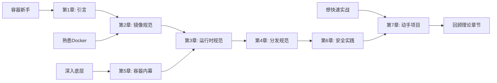

# AI-Powered Docker & OCI Specs Handbook

> 📖 **项目状态**: 活跃开发中 | **完成度**: 30%

利用 AI 深度解构 Docker 与 OCI 规范，涵盖镜像标准、Runtime 原理及容器底层协议的实战指南。

---

## 📚 关于本项目

本手册是一份系统性的容器技术学习指南，结合了传统技术文档的深度与 AI 辅助学习的创新性。

### ✨ 核心特色

- 🔬 **深度技术解析**：从底层原理到实现细节，不止于表面使用
- 🤖 **AI 赋能学习**：每章融入 AI 工具和智能化解决方案
- 🛠️ **实战导向**：包含可执行的动手项目和代码示例
- 📖 **OCI 规范权威解读**：基于官方规范的系统性讲解
- 🔗 **知识体系完整**：从历史演进到未来趋势的全景视角

### 🎯 与其他资源的差异

- **不同于官方文档**：更加系统化和循序渐进，适合学习而非查阅
- **不同于入门教程**：深入底层原理，满足进阶需求
- **不同于传统书籍**：融入 AI 时代的新工具和新方法

---

## 👥 目标读者

本手册适合以下人群：

- ✅ **后端开发者**：希望深入理解容器技术原理
- ✅ **DevOps 工程师**：需要掌握容器运维和优化技能
- ✅ **基础设施架构师**：设计容器化基础设施
- ✅ **技术爱好者**：对底层技术和开源标准感兴趣

### 📋 先决条件

- **必需**：
  - 基本的 Linux 命令行操作经验
  - 对 Docker 有基础认知（使用过 `docker run`、`docker build` 等命令）
  
- **建议**：
  - 了解 Linux 系统编程（进程、文件系统等）
  - 有一定的 Go 语言或其他编程语言基础

### 🎓 预期学习成果

通过本手册的学习，你将能够：

1. 深刻理解 OCI 三大规范的设计思想和实现细节
2. 掌握容器底层技术（Namespace、Cgroup、UnionFS）
3. 手动构建符合 OCI 标准的容器镜像和运行时
4. 运用 AI 工具优化容器开发和运维流程
5. 具备独立实现简单容器工具的能力

---

## 🚀 快速开始

### 📖 推荐学习路径

### 💡 使用建议

- **线性学习**：如果时间充裕，建议按章节顺序阅读
- **问题驱动**：遇到实际问题时，可直接跳转到相关章节
- **理论实践结合**：每学完一章理论，尝试完成对应的实战练习

---

## 📖 目录 (Table of Contents)

### 第一章：引言 (Chapter 1: Introduction)

> 了解容器技术的发展历程，掌握 OCI 规范的全局框架，探索 AI 在容器领域的应用前景

- 1.1 **容器技术演进史**：从 chroot 到 Docker 再到 OCI
- 1.2 **OCI (Open Container Initiative) 概览**：Image, Runtime, Distribution 三大支柱
- 1.3 **AI 在容器领域的应用**：智能化运维、镜像优化、安全扫描
- 1.4 **本书学习路线图**

---

### 第二章：OCI 镜像规范深度解析 (Chapter 2: OCI Image Specification)

> 从零开始理解容器镜像的内部结构，学会手动构建和优化镜像，掌握利用 AI 分析镜像的方法

- 2.1 **镜像结构解密**：Manifest, Config, Layers 详解
- 2.2 **文件系统层 (Layer)**：Tar 流与 Diff ID
- 2.3 **实战：手写一个 OCI 镜像**
- 2.4 **AI 赋能：利用 LLM 分析和优化镜像体积**

---

### 第三章：OCI 运行时规范与生命周期 (Chapter 3: OCI Runtime Specification)

> 深入理解容器运行时的工作机制，掌握不同 Runtime 的特点，学会配置和调优容器运行环境

- 3.1 **Runtime 架构**：runc, crun, kata-containers 对比
- 3.2 **容器生命周期管理**：create, start, kill, delete 流程
- 3.3 **Config.json 详解**：Namespaces, Cgroups, Capabilities 配置
- 3.4 **实战：使用 runc 手动运行容器**
- 3.5 **AI 赋能：智能生成与校验 Runtime 配置**

---

### 第四章：OCI 分发规范 (Chapter 4: OCI Distribution Specification)

> 掌握容器镜像的分发机制，理解 Registry 的工作原理，学会构建高效的镜像分发系统

- 4.1 **Registry API V2 详解**
- 4.2 **镜像推拉流程 (Push & Pull)**：Blob 上传与 Manifest 验证
- 4.3 **内容寻址存储 (CAS)** 原理
- 4.4 **AI 赋能：智能镜像缓存与分发策略**

---

### 第五章：容器底层技术内幕 (Chapter 5: Container Internals)

> 揭秘容器隔离的本质，深入 Linux 内核机制，理解容器与虚拟机的根本区别

- 5.1 **Linux Namespaces**：隔离的艺术 (PID, NET, MNT, etc.)
- 5.2 **Cgroups V1 vs V2**：资源限制与监控
- 5.3 **UnionFS (OverlayFS)**：写时复制机制
- 5.4 **容器网络模型 (CNI)** 简述

---

### 第六章：AI 驱动的容器安全与最佳实践 (Chapter 6: AI-Driven Security & Best Practices)

> 构建安全的容器化应用，运用 AI 工具自动检测漏洞，掌握供应链安全最佳实践

- 6.1 **容器镜像漏洞扫描**：AI 识别 CVE
- 6.2 **运行时安全监控**：基于 AI 的异常行为检测
- 6.3 **Dockerfile 最佳实践**：AI 辅助编写与审查
- 6.4 **供应链安全**：签名与验证 (Notary)

---

### 第七章：动手实战项目 (Chapter 7: Hands-on Projects)

> 通过三个完整项目，将理论知识转化为实践能力，构建自己的容器工具集

- 7.1 **Project A：用 Go 语言实现一个迷你容器 Runtime**
- 7.2 **Project B：构建基于 AI 的 Dockerfile 优化工具**
- 7.3 **Project C：实现一个简单的 OCI Registry**

---

## 🤝 贡献指南

我们欢迎所有形式的贡献！

### 如何贡献

- 🐛 **报告问题**：发现错误或有疑问？请提交 [Issue](../../issues)
- ✍️ **改进内容**：发现错别字或想补充内容？欢迎提交 PR
- 💡 **分享想法**：有好的建议？在 [Discussions](../../discussions) 中讨论
- ⭐ **Star 支持**：如果本项目对你有帮助，请给个 Star！

### 贡献者

感谢所有为本项目做出贡献的开发者！

<!-- 
未来可以添加贡献者列表

-->

---

## 📄 许可证

本项目采用 [MIT License](LICENSE) 开源协议。

---

## ⭐ Star History

<a href="https://star-history.com/#codetilldie/AI-Powered-Docker-OCI-Specs-Handbook&Date">
  <picture>
    <source media="(prefers-color-scheme: dark)" srcset="https://api.star-history.com/svg?repos=codetilldie/AI-Powered-Docker-OCI-Specs-Handbook&type=Date&theme=dark" />
    <source media="(prefers-color-scheme: light)" srcset="https://api.star-history.com/svg?repos=codetilldie/AI-Powered-Docker-OCI-Specs-Handbook&type=Date" />
    
  </picture>
</a>

---

## 🌟 致谢

- 感谢 [Open Container Initiative (OCI)](https://opencontainers.org/) 提供的开放标准
- 感谢所有容器技术的开源贡献者
- 感谢 AI 技术使知识获取更加高效

---

  <b>开始你的容器技术深度学习之旅吧！🚀</b>

