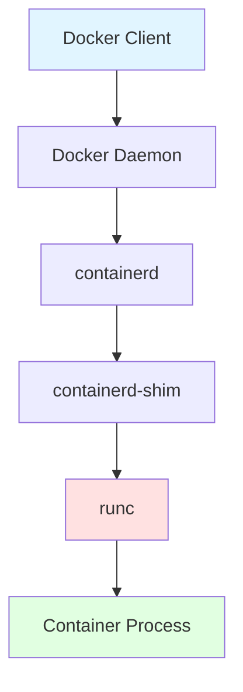
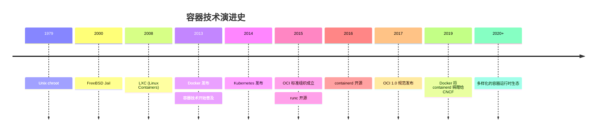
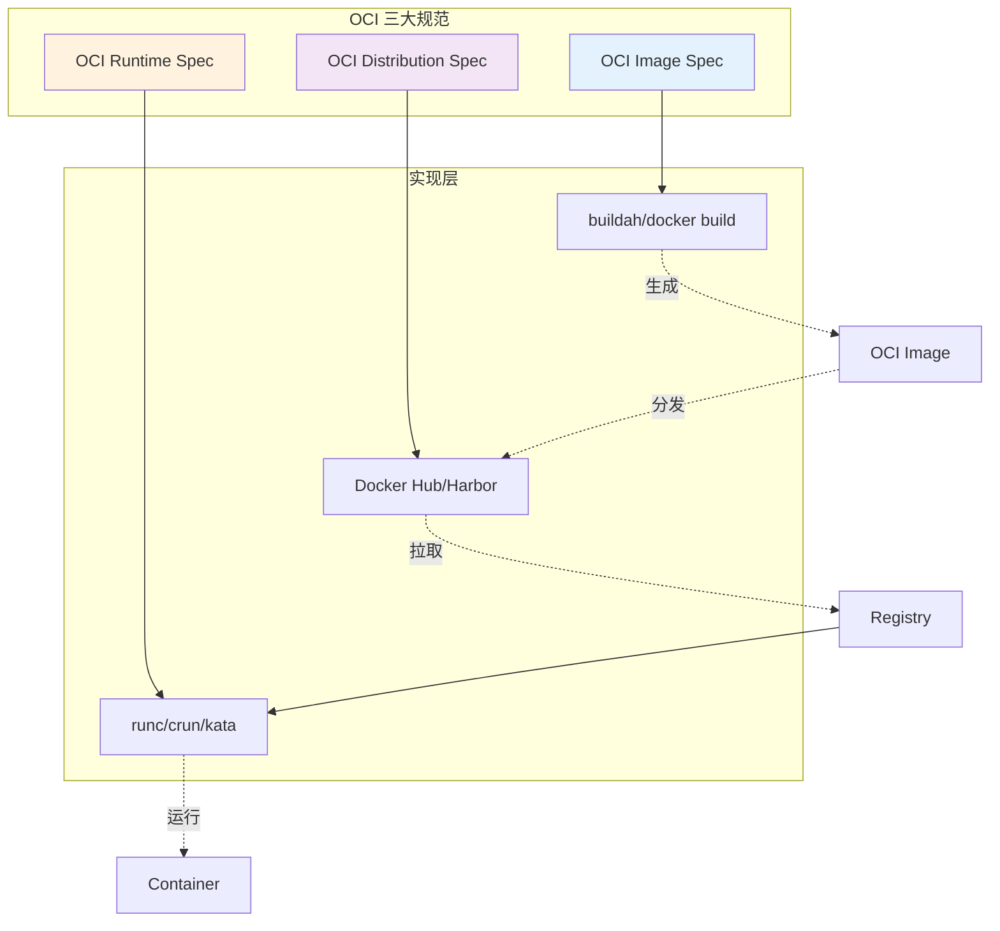
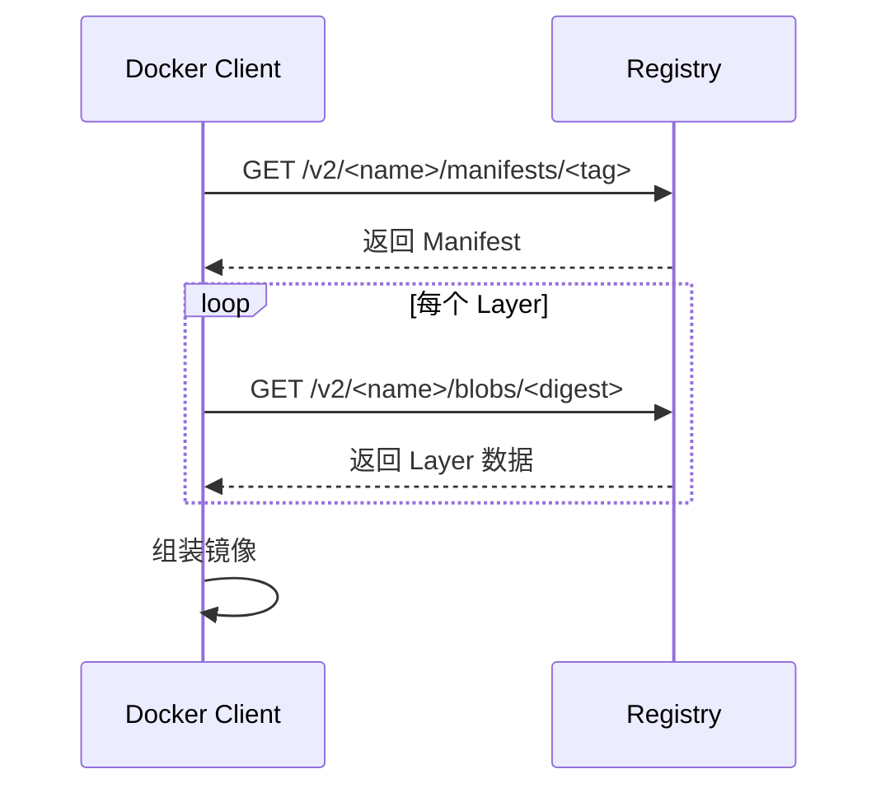
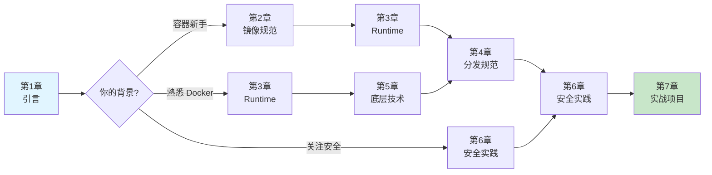
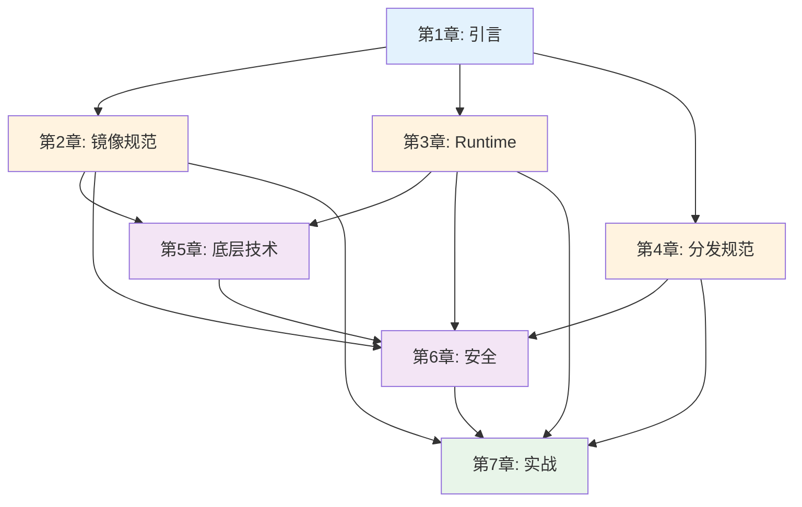

# 第一章：引言 (Chapter 1: Introduction)

> 了解容器技术的发展历程，掌握 OCI 规范的全局框架，探索 AI 在容器领域的应用前景

---

## 1.1 容器技术演进史：从 chroot 到 Docker 再到 OCI

### 1.1.1 容器的起源：Unix chroot (1979)

容器技术的历史可以追溯到 1979 年 Unix V7 中引入的 `chroot` 系统调用。chroot 允许将进程的根目录更改到文件系统的指定位置，从而实现简单的文件系统隔离。

```bash
# chroot 示例
mkdir /tmp/jail
cp /bin/bash /tmp/jail/bin/
chroot /tmp/jail /bin/bash
```

**局限性**：
- 仅提供文件系统隔离
- 无资源限制能力
- 无进程、网络隔离

### 1.1.2 FreeBSD Jail (2000)

FreeBSD 在 chroot 的基础上引入了 Jail 机制，提供了更完善的隔离：
- 独立的主机名和 IP 地址
- 独立的进程空间
- 受限的文件系统访问

### 1.1.3 Linux 容器技术的崛起

#### Linux-VServer (2001)
早期的 Linux 虚拟化方案，通过内核补丁实现操作系统级虚拟化。

#### OpenVZ (2005)
商业化的容器解决方案，后来开源为 Virtuozzo。

#### LXC - Linux Containers (2008)
真正现代意义上的 Linux 容器技术，整合了：
- **Namespaces**：进程、网络、用户等隔离
- **Cgroups (Control Groups)**：资源限制和监控
- **UnionFS**：分层文件系统

```bash
# LXC 创建容器示例
lxc-create -t ubuntu -n my-container
lxc-start -n my-container
```

### 1.1.4 Docker 革命 (2013)

Docker 并未发明容器技术，但它做了三件重要的事：

1. **简化容器使用**：
   ```bash
   # 对比 LXC 的复杂配置，Docker 极其简单
   docker run -it ubuntu bash
   ```

2. **引入镜像标准**：
   - 分层文件系统（Layer-based）
   - 可移植的镜像格式
   - Dockerfile 构建脚本

3. **建立生态系统**：
   - Docker Hub（公共镜像仓库）
   - 开发者友好的工具链
   - 庞大的社区

#### Docker 的技术栈演进



### 1.1.5 OCI 标准的诞生 (2015)

随着容器技术的快速发展，产生了标准化的需求：

**问题**：
- Docker 一家独大，缺乏竞争
- 不同容器运行时之间不兼容
- 镜像格式碎片化

**解决方案**：
2015 年 6 月，Docker、CoreOS、Google、Microsoft 等公司联合成立 **Open Container Initiative (OCI)**，目标是：

> 创建开放的容器格式和运行时的行业标准

**OCI 里程碑**：

| 时间 | 事件 |
|------|------|
| 2015.06 | OCI 成立 |
| 2016.04 | runc 1.0.0-rc1 发布 |
| 2017.07 | OCI Runtime Spec 1.0 发布 |
| 2017.07 | OCI Image Spec 1.0 发布 |
| 2018.04 | OCI Distribution Spec 项目启动 |

### 1.1.6 容器技术时间线



---

## 1.2 OCI (Open Container Initiative) 概览：三大支柱

OCI 定义了三个核心规范，共同构成了完整的容器生态标准。

### 1.2.1 OCI 规范架构



### 1.2.2 Image Specification（镜像规范）

定义了容器镜像的格式和内容结构。

**核心组件**：

1. **Image Manifest**：镜像的元数据描述
   ```json
   {
     "schemaVersion": 2,
     "mediaType": "application/vnd.oci.image.manifest.v1+json",
     "config": {
       "mediaType": "application/vnd.oci.image.config.v1+json",
       "digest": "sha256:abc123...",
       "size": 1234
     },
     "layers": [...]
   }
   ```

2. **Image Config**：镜像的配置文件
   - 环境变量
   - 工作目录
   - 入口命令
   - 标签和元数据

3. **Layers**：文件系统层
   - 每层是 tar.gz 压缩包
   - 通过 diff 实现增量存储
   - 层可以在不同镜像间共享

**特点**：
- ✅ 内容寻址（Content Addressable）：通过 SHA256 保证完整性
- ✅ 平台无关：支持多架构（amd64, arm64 等）
- ✅ 高效存储：分层+去重

### 1.2.3 Runtime Specification（运行时规范）

定义了如何从 OCI 镜像创建和运行容器。

**核心概念**：

1. **Bundle**：运行时需要的所有文件
   ```
   <bundle>/
   ├── config.json          # 容器配置
   └── rootfs/             # 容器根文件系统
       ├── bin/
       ├── etc/
       └── ...
   ```

2. **config.json**：定义容器行为
   ```json
   {
     "ociVersion": "1.0.0",
     "process": {
       "args": ["/bin/sh"]
     },
     "root": {
       "path": "rootfs"
     },
     "linux": {
       "namespaces": [...],
       "resources": {...}
     }
   }
   ```

3. **容器生命周期**：
   - `create` → `start` → `kill` → `delete`

**实现示例**：
- **runc**：Go 语言，Docker 默认
- **crun**：C 语言，性能更优
- **kata-containers**：虚拟化安全容器

### 1.2.4 Distribution Specification（分发规范）

定义了容器镜像的分发协议（Registry API）。

**核心功能**：

| 操作 | HTTP 方法 | 路径 |
|------|-----------|------|
| 检查镜像存在 | HEAD | `/v2/<name>/manifests/<reference>` |
| 拉取 Manifest | GET | `/v2/<name>/manifests/<reference>` |
| 上传 Blob | PUT | `/v2/<name>/blobs/uploads/<uuid>` |
| 删除镜像 | DELETE | `/v2/<name>/manifests/<reference>` |

**工作流程**：



**Registry 实现**：
- Docker Hub
- Harbor
- Google Container Registry (GCR)
- AWS ECR

---

## 1.3 AI 在容器领域的应用：智能化运维、镜像优化、安全扫描

AI 技术正在深刻改变容器技术的开发和运维方式。

### 1.3.1 智能化运维 (AIOps)

#### 资源调度优化

传统 Kubernetes 调度器基于规则，AI 可以：
- **预测性调度**：基于历史数据预测资源需求
- **智能扩容**：机器学习模型预测流量峰值
- **成本优化**：在性能和成本间找到最优平衡

**示例框架**：
```python
# 使用 Prophet 预测容器资源需求
from prophet import Prophet

# 训练模型
model = Prophet()
model.fit(historical_cpu_data)

# 预测未来 24 小时
future = model.make_future_dataframe(periods=24, freq='H')
forecast = model.predict(future)

# 基于预测调整副本数
if forecast['yhat'].max() > threshold:
    scale_up_replicas()
```

#### 异常检测

AI 可以识别容器行为异常：
- 内存泄漏检测
- CPU 异常飙升根因分析
- 网络流量异常

**工具**：
- **Prometheus + AI**：时序数据异常检测
- **ELK + ML**：日志异常分析

### 1.3.2 镜像优化

#### 镜像体积分析

AI 辅助工具可以：
- 分析镜像层依赖关系
- 识别冗余文件
- 推荐最优基础镜像

**案例**：使用 LLM 优化 Dockerfile

```dockerfile
# 原始 Dockerfile（问题：体积大、层多）
FROM ubuntu:latest
RUN apt-get update
RUN apt-get install -y python3
RUN apt-get install -y python3-pip
COPY . /app
RUN pip3 install -r requirements.txt

# AI 优化后
FROM python:3.11-slim
WORKDIR /app
COPY requirements.txt .
RUN pip install --no-cache-dir -r requirements.txt
COPY . .
```

**AI 优化点**：
1. 选择更小的基础镜像（slim）
2. 合并 RUN 指令减少层数
3. 利用构建缓存（requirements.txt 先复制）
4. 清理缓存（`--no-cache-dir`）

#### 多架构镜像生成

AI 可以自动生成多架构 Dockerfile：
```bash
# AI 生成 buildx 命令
docker buildx build \
  --platform linux/amd64,linux/arm64 \
  -t myapp:latest --push .
```

### 1.3.3 安全扫描

#### 漏洞检测

AI 增强的安全扫描：

| 传统扫描 | AI 增强扫描 |
|----------|------------|
| 基于已知 CVE 数据库 | 预测潜在漏洞 |
| 静态规则匹配 | 代码模式学习 |
| 高误报率 | 智能过滤误报 |

**工具集成**：
```yaml
# GitHub Actions + AI 安全扫描
- name: AI Security Scan
  uses: aquasecurity/trivy-action@master
  with:
    image-ref: 'myapp:latest'
    format: 'json'
    
- name: AI Analysis
  run: |
    # 使用 AI 模型分析 Trivy 结果
    python analyze_vulnerabilities.py \
      --model gpt-4 \
      --input trivy-results.json
```

#### 运行时威胁检测

AI 监控容器行为：
- 检测异常系统调用
- 识别恶意网络连接
- 发现加密货币挖矿行为

**实现**：
```python
# 使用 LSTM 检测异常系统调用序列
import tensorflow as tf

model = tf.keras.Sequential([
    tf.keras.layers.LSTM(128, input_shape=(sequence_length, num_features)),
    tf.keras.layers.Dense(64, activation='relu'),
    tf.keras.layers.Dense(1, activation='sigmoid')  # 0=正常, 1=异常
])

# 实时监控
syscalls = monitor_container_syscalls(container_id)
is_anomalous = model.predict(syscalls) > 0.5
if is_anomalous:
    alert_security_team()
```

### 1.3.4 智能 Dockerfile 生成

**提示词工程示例**：

```
用户: 帮我创建一个 Python Flask 应用的 Dockerfile，要求：
- 生产环境优化
- 多阶段构建
- 非 root 用户运行
- 健康检查

AI 生成:
```dockerfile
# 阶段 1: 构建
FROM python:3.11-slim as builder
WORKDIR /app
COPY requirements.txt .
RUN pip install --user --no-cache-dir -r requirements.txt

# 阶段 2: 运行
FROM python:3.11-slim
WORKDIR /app

# 创建非 root 用户
RUN useradd -m -u 1000 appuser && chown -R appuser /app
USER appuser

# 复制依赖
COPY --from=builder /root/.local /home/appuser/.local
ENV PATH=/home/appuser/.local/bin:$PATH

# 复制应用
COPY --chown=appuser:appuser . .

# 健康检查
HEALTHCHECK --interval=30s --timeout=3s \
  CMD curl -f http://localhost:5000/health || exit 1

EXPOSE 5000
CMD ["python", "app.py"]
```
```

---

## 1.4 本书学习路线图

### 1.4.1 学习路径总览



### 1.4.2 按角色推荐

#### 🔧 后端开发者

**目标**：理解容器化应用的最佳实践

**学习路径**：
1. 第 1 章：引言 → 了解背景
2. 第 2 章：镜像规范 → 优化应用镜像
3. 第 6 章：安全实践 → 编写安全的 Dockerfile
4. 第 7 章：项目 B → 构建 Dockerfile 优化工具

**预计时间**：1-2 周

#### ⚙️ DevOps 工程师

**目标**：掌握容器运维和调优

**学习路径**：
1. 第 1 章：引言
2. 第 3 章：Runtime 规范 → 理解容器生命周期
3. 第 4 章：分发规范 → 搭建私有 Registry
4. 第 5 章：底层技术 → 性能调优
5. 第 6 章：安全实践 → 构建安全运维体系
6. 第 7 章：全部项目

**预计时间**：3-4 周

#### 🏗️ 架构师

**目标**：系统性理解容器技术栈

**学习路径**：
1. 第 1-7 章：顺序学习
2. 重点：第 3、4、5 章的原理部分
3. 扩展：研究 OCI 官方规范文档

**预计时间**：4-6 周

### 1.4.3 章节依赖关系



**说明**：
- **蓝色（基础）**：必读章节
- **橙色（核心）**：OCI 三大规范
- **紫色（进阶）**：深入原理
- **绿色（实践）**：动手项目

### 1.4.4 学习建议

#### ✅ 推荐做法

1. **理论与实践结合**
   - 每学完一章，完成对应的实验
   - 在真实环境中验证概念

2. **使用 AI 辅助**
   - ChatGPT/Claude：解答疑惑
   - GitHub Copilot：编写代码
   - AI 分析工具：理解复杂配置

3. **参与社区**
   - 阅读 OCI 官方规范
   - 参与 GitHub 讨论
   - 分享学习笔记

4. **构建项目**
   - 不要只看不做
   - 第 7 章的项目至少完成一个

#### ❌ 避免的坑

1. **跳过基础章节**
   - 即使熟悉 Docker，也建议快速浏览第 1、2 章

2. **过度依赖 AI**
   - AI 是辅助工具，不能替代理解

3. **忽视官方文档**
   - 本书是学习指南，官方规范是权威参考

4. **只学不练**
   - 容器技术强调实践

### 1.4.5 配套资源

#### 📚 推荐阅读

- [OCI 官方规范](https://opencontainers.org/)
- [runc 源码](https://github.com/opencontainers/runc)
- [containerd 文档](https://containerd.io/)

#### 🛠️ 实验环境

```bash
# 推荐使用 Linux 环境（Ubuntu 22.04 或更高版本）
# 安装必要工具
sudo apt-get update
sudo apt-get install -y \
    docker.io \
    runc \
    buildah \
    skopeo

# 验证安装
docker --version
runc --version
```

#### 💬 社区支持

- **GitHub Discussions**：本项目的讨论区
- **CNCF Slack**：#oci 频道
- **Stack Overflow**：标签 `oci` `runc` `containerd`

---

## 下一章预告

在下一章《OCI 镜像规范深度解析》中，我们将：

- 🔍 深入剖析镜像的分层存储机制
- 📦 手把手教你构建符合 OCI 标准的镜像
- 🤖 使用 AI 工具分析和优化镜像大小
- 🧪 实验：不使用 Docker，纯手工创建 OCI 镜像

**[>> 进入第二章](./02-oci-image-spec.md)**

---

## 参考资料

1. [Open Container Initiative Official Site](https://opencontainers.org/)
2. [The History of Containers](https://blog.aquasec.com/a-brief-history-of-containers-from-1970s-chroot-to-docker-2016)
3. [OCI Runtime Specification](https://github.com/opencontainers/runtime-spec)
4. [OCI Image Specification](https://github.com/opencontainers/image-spec)
5. [Docker Documentation](https://docs.docker.com/)

---

**贡献者欢迎**: 如果您对本章节有内容补充或建议,欢迎提交 PR 或 Issue！
