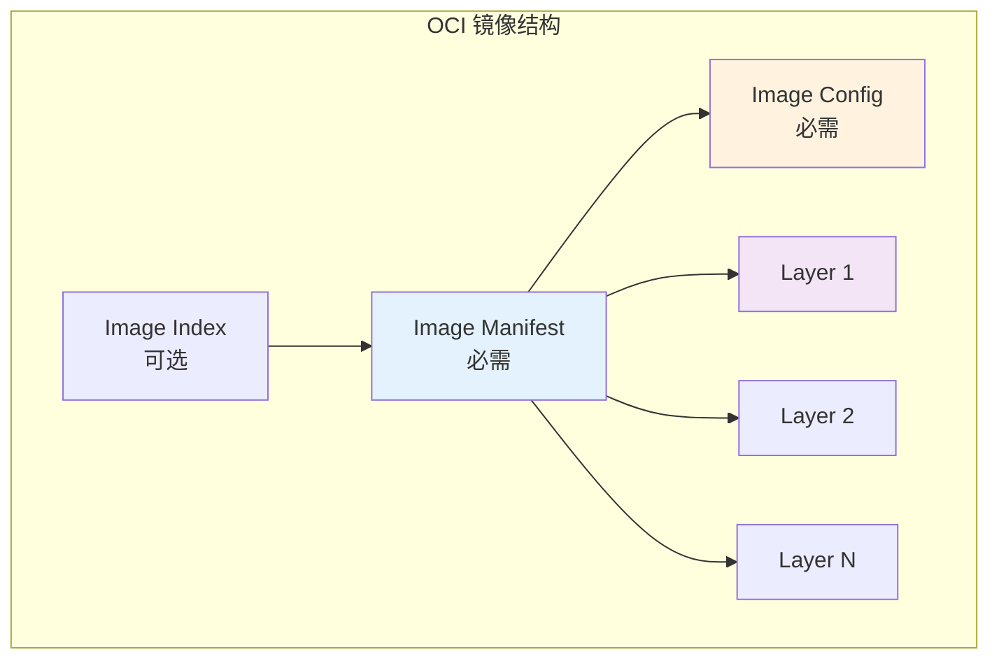
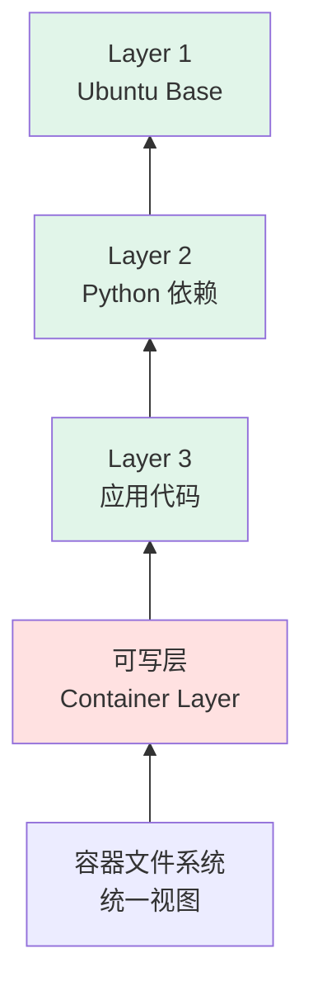

# 第二章：OCI 镜像规范深度解析 (Chapter 2: OCI Image Specification)

> 从零开始理解容器镜像的内部结构，学会手动构建和优化镜像，掌握利用 AI 分析镜像的方法

---

OCI (Open Container Initiative) 镜像规范定义了容器镜像的文件格式和配置标准，确保了不同容器运行时（如 Docker, containerd, Podman）能够运行同一个镜像。本章将深入解构 OCI 镜像的组成部分，带你通过手写的方式构建一个标准镜像，并探讨 AI 如何辅助镜像优化。

## 2.1 镜像结构解密：Manifest, Config, Layers 详解

### 2.1.1 OCI 镜像的组成

一个标准的 OCI 镜像并不是一个单一的文件（如 ISO），而是一组文件的集合。这些文件通常存储在 Registry 中，或者以 OCI Layout 的目录形式存在本地。



**核心组件**：
1. **Image Index (索引)**：可选，用于多架构镜像
2. **Image Manifest (清单)**：镜像的"发货单"
3. **Image Config (配置)**：运行时元数据 
4. **Layers (层)**：文件系统的实际数据

### 2.1.2 Image Manifest (清单)

Manifest 是镜像的入口点，它像是一个"发货单"，列出了组成该镜像的所有"货物"。

**作用**：指向镜像的配置 (Config) 和所有文件系统层 (Layers)。

**关键字段**：
- `schemaVersion`：规范版本（通常为 2）
- `mediaType`：Manifest 类型
- `config`：指向Config 文件的 Descriptor
- `layers`：Layer 数组，按顺序排列

**完整示例**：
```json
{
  "schemaVersion": 2,
  "mediaType": "application/vnd.oci.image.manifest.v1+json",
  "config": {
    "mediaType": "application/vnd.oci.image.config.v1+json",
    "size": 7023,
    "digest": "sha256:b5b2b2c507a0944348e0303114d8d93aaaa081732b86451d9bce1f432a537bc7"
  },
  "layers": [
    {
      "mediaType": "application/vnd.oci.image.layer.v1.tar+gzip",
      "size": 32654,
      "digest": "sha256:9834876dcfb05cb167a5c24953eba58c4ac899ae4210582db84156d7188d9380"
    },
    {
      "mediaType": "application/vnd.oci.image.layer.v1.tar+gzip",
      "size": 16724,
      "digest": "sha256:3c3a4604a545cdc127456d94e421cd355bca5b528f4a9c1905b15da2eb4a4c6b"
    }
  ],
  "annotations": {
    "org.opencontainers.image.created": "2023-01-15T14:32:00Z",
    "org.opencontainers.image.authors": "AI-Powered Handbook Team"
  }
}
```

**Descriptor 结构**：
每个 Config 和 Layer 都通过 Descriptor 引用，包含：
- `mediaType`：内容类型
- `digest`：SHA256 哈希值（内容寻址）
- `size`：字节大小
- `urls`（可选）：外部下载链接

### 2.1.3 Image Configuration (配置)

Config 是一个 JSON 文件，描述了镜像的元数据和运行时环境。

**完整 Config 示例**：
```json
{
  "architecture": "amd64",
  "os": "linux",
  "created": "2023-01-15T14:32:00Z",
  "author": "AI-Powered Handbook Team <team@example.com>",
  "config": {
    "User": "appuser",
    "ExposedPorts": {
      "8080/tcp": {}
    },
    "Env": [
      "PATH=/usr/local/sbin:/usr/local/bin:/usr/sbin:/usr/bin:/sbin:/bin",
      "APP_ENV=production"
    ],
    "Entrypoint": ["/app/server"],
    "Cmd": ["--port=8080"],
    "WorkingDir": "/app",
    "Labels": {
      "version": "1.0.0",
      "maintainer": "team@example.com"
    }
  },
  "rootfs": {
    "type": "layers",
    "diff_ids": [
      "sha256:abc123...",  // DiffID (解压后的 hash)
      "sha256:def456..."
    ]
  },
  "history": [
    {
      "created": "2023-01-15T14:30:00Z",
      "created_by": "/bin/sh -c #(nop) ADD file:aaa... in /",
      "empty_layer": false
    },
    {
      "created": "2023-01-15T14:31:00Z",
      "created_by": "/bin/sh -c apt-get update",
      "empty_layer": false
    }
  ]
}
```

**关键字段解析**：

| 字段 | 说明 | 示例 |
|------|------|------|
| `architecture` | CPU 架构 | `amd64`, `arm64`, `riscv64` |
| `os` | 操作系统 | `linux`, `windows` |
| `config.User` | 运行用户 | `root`, `1000:1000` |
| `config.Env` | 环境变量 | `["PATH=...", "APP_ENV=prod"]` |
| `config.Entrypoint` | 入口点 | `["/bin/sh", "-c"]` |
| `config.Cmd` | 默认命令 | `["echo", "hello"]` |
| `rootfs.diff_ids` | 层的 DiffID | `["sha256:abc..."]` |

### 2.1.4 Image Layers (层)

Layer 是实际的文件系统变更，通常是 `tar` 或 `tar.gz` 包。

**Layer 类型**：
```json
{
  "mediaType": "application/vnd.oci.image.layer.v1.tar+gzip",  // gzip 压缩
  "mediaType": "application/vnd.oci.image.layer.v1.tar",       // 未压缩
  "mediaType": "application/vnd.oci.image.layer.nondistributable.v1.tar+gzip"  // 非分发层
}
```

**Layer 内容示例**：
```bash
# Layer 1: 基础文件系统
/bin/
/etc/
/lib/
/usr/

# Layer 2: 应用依赖
/usr/local/lib/python3.11/
/usr/local/bin/pip

# Layer 3: 应用代码
/app/server.py
/app/requirements.txt
```

**重要特性**：
- ✅ **内容寻址**：通过 SHA256 确保不可变性
- ✅ **增量修改**：每层只包含相对于上一层的变更
- ✅ **可复用**：多个镜像可共享相同的 Layer

---

## 2.2 文件系统层 (Layer)：Tar 流与 Diff ID

### 2.2.1 层的叠加 (UnionFS)

容器运行时使用联合文件系统 (UnionFS, 如 Overlay2) 将多个只读的 Layer 叠加在一起，形成一个统一的视图。



**层叠加示例**：
```
容器视图: /app/server.py     ← 来自 Layer 3
         /usr/bin/python    ← 来自 Layer 2  
         /bin/sh            ← 来自 Layer 1
```

### 2.2.2 Diff ID vs. Distribution Digest

这是一个常见的混淆点：

| 类型 | 位置 | 计算方式 | 用途 |
|------|------|---------|------|
| **Distribution Digest** | Manifest | 压缩后的 tar.gz 的 SHA256 | Registry 传输 |
| **Diff ID** | Config | 解压后的 tar 的 SHA256 | 本地校验 |

**示例对比**：
```bash
# Layer 原始数据 (tar)
layer.tar  → sha256:abc123...  (Diff ID)

# 压缩后 (tar.gz)
layer.tar.gz → sha256:xyz789...  (Distribution Digest)
```

**为什么需要两个 Digest？**
1. **传输效率**：gzip 压缩可减少 50-90% 体积
2. **完整性校验**：
   - Registry 用 Distribution Digest 验证传输
   - Runtime 用 Diff ID 验证解压後的数据

### 2.2.3 Tar 流格式深入

**Tar 文件结构**：
```
[Header (512 bytes)]
[Data (align to 512 bytes)]
[Header (512 bytes)]
[Data (align to 512 bytes)]
...
[EOF (1024 bytes of zeros)]
```

**Header 关键字段**：
- 文件名（100 bytes）
- 文件模式（8 bytes）
- UID/GID（8 bytes 各）
- 文件大小（12 bytes）
- 修改时间（12 bytes）

**创建 Layer 示例**：
```bash
# 创建文件
mkdir layer
echo "Hello OCI" > layer/hello.txt

# 打包为 tar
tar -C layer -cvf layer.tar .

# 计算 Diff ID
sha256sum layer.tar
# 输出: abc123... layer.tar

# 压缩
gzip layer.tar

# 计算 Distribution Digest
sha256sum layer.tar.gz
# 输出: xyz789... layer.tar.gz
```

---

## 2.3 实战：手写一个完整的 OCI 镜像

我们将不使用 `docker build`，而是手动创建一个符合 OCI 标准的完整镜像。

### 步骤 1: 创建项目结构

```bash
mkdir -p my-oci-image/{blobs/sha256,refs}
cd my-oci-image

# 创建 OCI Layout 标识文件
cat > oci-layout << EOF
{
  "imageLayoutVersion": "1.0.0"
}
EOF
```

### 步骤 2: 准备 Rootfs Layer

```bash
# 创建简单的文件系统
mkdir -p rootfs/{bin,etc,app}

# 添加 busybox（或从现有镜像导出）
# 这里假设我们有一个最小的可执行文件
echo '#!/bin/sh\necho "Hello from OCI Image!"' > rootfs/app/hello.sh
chmod +x rootfs/app/hello.sh

# 打包为 tar
tar -C rootfs -cf layer1.tar .

# 计算 Diff ID
DIFF_ID=$(sha256sum layer1.tar | awk '{print $1}')
echo "Diff ID: sha256:$DIFF_ID"

# 压缩
gzip layer1.tar

# 计算 Distribution Digest 并存储
LAYER_DIGEST=$(sha256sum layer1.tar.gz | awk '{print $1}')
LAYER_SIZE=$(stat -f%z layer1.tar.gz 2>/dev/null || stat -c%s layer1.tar.gz)
echo "Layer Digest: sha256:$LAYER_DIGEST"
echo "Layer Size: $LAYER_SIZE"

# 将 Layer 移入 blobs
mv layer1.tar.gz blobs/sha256/$LAYER_DIGEST
```

### 步骤 3: 创建 Image Config

```bash
# 生成 Config JSON
CONFIG_FILE="config.json"

cat > $CONFIG_FILE << EOF
{
  "architecture": "amd64",
  "os": "linux",
  "created": "$(date -u +%Y-%m-%dT%H:%M:%SZ)",
  "author": "OCI Handbook",
  "config": {
    "User": "root",
    "Env": [
      "PATH=/usr/local/sbin:/usr/local/bin:/usr/sbin:/usr/bin:/sbin:/bin"
    ],
    "Cmd": ["/app/hello.sh"],
    "WorkingDir": "/app"
  },
  "rootfs": {
    "type": "layers",
    "diff_ids": [
      "sha256:$DIFF_ID"
    ]
  },
  "history": [
    {
      "created": "$(date -u +%Y-%m-%dT%H:%M:%SZ)",
      "created_by": "手动创建 OCI 镜像",
      "author": "OCI Handbook"
    }
  ]
}
EOF

# 计算 Config Digest
CONFIG_DIGEST=$(sha256sum $CONFIG_FILE | awk '{print $1}')
CONFIG_SIZE=$(stat -f%z $CONFIG_FILE 2>/dev/null || stat -c%s $CONFIG_FILE)
echo "Config Digest: sha256:$CONFIG_DIGEST"

# 移入 blobs
cp $CONFIG_FILE blobs/sha256/$CONFIG_DIGEST
```

### 步骤 4: 创建 Image Manifest

```bash
MANIFEST_FILE="manifest.json"

cat > $MANIFEST_FILE << EOF
{
  "schemaVersion": 2,
  "mediaType": "application/vnd.oci.image.manifest.v1+json",
  "config": {
    "mediaType": "application/vnd.oci.image.config.v1+json",
    "size": $CONFIG_SIZE,
    "digest": "sha256:$CONFIG_DIGEST"
  },
  "layers": [
    {
      "mediaType": "application/vnd.oci.image.layer.v1.tar+gzip",
      "size": $LAYER_SIZE,
      "digest": "sha256:$LAYER_DIGEST"
    }
  ],
  "annotations": {
    "org.opencontainers.image.created": "$(date -u +%Y-%m-%dT%H:%M:%SZ)",
    "org.opencontainers.image.authors": "OCI Handbook Team"
  }
}
EOF

# 计算 Manifest Digest
MANIFEST_DIGEST=$(sha256sum $MANIFEST_FILE | awk '{print $1}')
MANIFEST_SIZE=$(stat -f%z $MANIFEST_FILE 2>/dev/null || stat -c%s $MANIFEST_FILE)

# 移入 blobs
cp $MANIFEST_FILE blobs/sha256/$MANIFEST_DIGEST
```

### 步骤 5: 创建 Index

```bash
cat > index.json << EOF
{
  "schemaVersion": 2,
  "manifests": [
    {
      "mediaType": "application/vnd.oci.image.manifest.v1+json",
      "size": $MANIFEST_SIZE,
      "digest": "sha256:$MANIFEST_DIGEST",
      "annotations": {
        "org.opencontainers.image.ref.name": "latest"
      }
    }
  ]
}
EOF
```

### 步骤 6: 验证和使用

```bash
# 使用 skopeo 验证
skopeo inspect oci:./my-oci-image

# 输出类似：
{
  "Name": "my-oci-image",
  "Digest": "sha256:...",
  "RepoTags": [],
  "Created": "2024-01-15T10:30:00Z",
  "Architecture": "amd64",
  "Os": "linux",
  ...
}

# 复制到本地 Docker
skopeo copy oci:./my-oci-image docker-daemon:my-oci-image:latest

# 运行
docker run --rm my-oci-image:latest
```

**最终目录结构**：
```
my-oci-image/
├── oci-layout
├── index.json
└── blobs/
    └── sha256/
        ├── abc123...  (Config)
        ├── def456...  (Layer)
        └── ghi789...  (Manifest)
```

---

## 2.4 多架构镜像支持

### 2.4.1 Image Index (Fat Manifest)

对于需要支持多个架构（如 amd64, arm64）的镜像，OCI 使用 **Image Index**（也称为 Fat Manifest）。

**Image Index 示例**：
```json
{
  "schemaVersion": 2,
  "mediaType": "application/vnd.oci.image.index.v1+json",
  "manifests": [
    {
      "mediaType": "application/vnd.oci.image.manifest.v1+json",
      "size": 7143,
      "digest": "sha256:amd64manifest...",
      "platform": {
        "architecture": "amd64",
        "os": "linux"
      }
    },
    {
      "mediaType": "application/vnd.oci.image.manifest.v1+json",
      "size": 7682,
      "digest": "sha256:arm64manifest...",
      "platform": {
        "architecture": "arm64",
        "os": "linux"
      }
    }
  ]
}
```

### 2.4.2 创建多架构镜像

```bash
# 使用 Docker buildx
docker buildx create --use
docker buildx build --platform linux/amd64,linux/arm64 \
  -t myregistry.com/myapp:latest --push .

# 检查
docker manifest inspect myregistry.com/myapp:latest
```

---

## 2.5 AI 赋能：利用 AI 分析和优化镜像

### 2.5.1 AI 镜像分析工具

#### 完整实现示例

```python
import json
import openai
from typing import List, Dict

class AIImageAnalyzer:
    def __init__(self, api_key: str):
        openai.api_key = api_key
    
    def analyze_manifest(self, manifest_path: str) -> Dict:
        """分析 Manifest 并提供优化建议"""
        with open(manifest_path) as f:
            manifest = json.load(f)
        
        # 提取关键信息
        layer_count = len(manifest.get('layers', []))
        total_size = sum(l['size'] for l in manifest.get('layers', []))
        
        prompt = f"""
分析以下 OCI 镜像 Manifest：

层数量: {layer_count}
总大小: {total_size / (1024*1024):.2f} MB
Manifest: {json.dumps(manifest, indent=2)}

请提供：
1. 镜像体积优化建议（如合并层、清理缓存）
2. 安全隐患（如敏感信息泄露）
3. 最佳实践违规（如缺少 annotations）
4. 性能优化建议

以 JSON 格式输出。
"""
        
        response = openai.ChatCompletion.create(
            model="gpt-4",
            messages=[{"role": "user", "content": prompt}]
        )
        
        return json.loads(response.choices[0].message.content)
    
    def optimize_layers(self, layers: List[str]) -> List[str]:
        """AI 建议层合并策略"""
        prompt = f"""
以下是 Dockerfile 产生的层列表：
{json.dumps(layers, indent=2)}

哪些层可以合并以减少镜像大小？
返回优化后的 Dockerfile 片段。
"""
        
        response = openai.ChatCompletion.create(
            model="gpt-4",
            messages=[{"role": "user", "content": prompt}]
        )
        
        return response.choices[0].message.content

# 使用示例
analyzer = AIImageAnalyzer(api_key="sk-...")
report = analyzer.analyze_manifest("manifest.json")
print(json.dumps(report, indent=2))
```

**AI 输出示例**：
```json
{
  "size_optimization": {
    "current_size_mb": 523.5,
    "potential_savings_mb": 187.2,
    "suggestions": [
      "Layer 5 和 Layer 6 都是 apt-get 操作，可以合并",
      "Layer 8 包含 55MB 的 /var/cache/apt，应在同层删除"
    ]
  },
  "security_issues": [
    {
      "severity": "High",
      "layer": 3,
      "issue": "Layer 包含 .git 目录，可能泄露源代码",
      "fix": "添加 .dockerignore"
    }
  ],
  "best_practices": [
    "建议添加 org.opencontainers.image.source annotation",
    "Config 中未指定 User，将以 root 运行"
  ]
}
```

### 2.5.2 智能 Dockerfile 生成

```python
def generate_optimized_dockerfile(requirements: Dict) -> str:
    prompt = f"""
根据以下需求生成优化的 Dockerfile：

应用类型: {requirements['app_type']}
语言: {requirements['language']}
依赖: {requirements['dependencies']}
暴露端口: {requirements['port']}

要求：
1. 多阶段构建
2. 非 root 用户
3. 最小化镜像体积
4. 健康检查
5. 使用 Alpine 基础镜像

只输出 Dockerfile。
"""
    
    response = openai.ChatCompletion.create(
        model="gpt-4",
        messages=[{"role": "user", "content": prompt}],
        temperature=0.3
    )
    
    return response.choices[0].message.content

# 使用
dockerfile = generate_optimized_dockerfile({
    'app_type': 'REST API',
    'language': 'Python 3.11',
    'dependencies': ['flask', 'gunicorn'],
    'port': 5000
})

print(dockerfile)
```

**生成的 Dockerfile**：
```dockerfile
# 构建阶段
FROM python:3.11-alpine AS builder
WORKDIR /build
COPY requirements.txt .
RUN pip install --user --no-cache-dir -r requirements.txt

# 运行阶段
FROM python:3.11-alpine
WORKDIR /app

# 创建非 root 用户
RUN adduser -D -u 1000 appuser

# 复制依赖
COPY --from=builder /root/.local /home/appuser/.local

# 设置环境变量
ENV PATH=/home/appuser/.local/bin:$PATH

# 复制应用代码
COPY --chown=appuser:appuser . .

# 切换用户
USER appuser

# 健康检查
HEALTHCHECK --interval=30s --timeout=3s \
  CMD wget --no-verbose --tries=1 --spider http://localhost:5000/health || exit 1

EXPOSE 5000

CMD ["gunicorn", "--bind", "0.0.0.0:5000", "app:app"]
```

### 2.5.3 语义化镜像搜索

```python
from sentence_transformers import SentenceTransformer
import faiss
import numpy as np

class SemanticImageSearch:
    def __init__(self):
        self.model = SentenceTransformer('all-MiniLM-L6-v2')
        self.index = None
        self.images = []
        
    def index_images(self, image_descriptions: List[Dict]):
        """索引镜像描述"""
        self.images = image_descriptions
        
        # 生成 embeddings
        texts = [f"{img['name']} {img['description']}" for img in image_descriptions]
        embeddings = self.model.encode(texts)
        
        # 创建 FAISS 索引
        dimension = embeddings.shape[1]
        self.index = faiss.IndexFlatL2(dimension)
        self.index.add(embeddings.astype('float32'))
    
    def search(self, query: str, top_k: int = 5):
        """语义搜索镜像"""
        query_embedding = self.model.encode([query])
        distances, indices = self.index.search(query_embedding.astype('float32'), top_k)
        
        return [self.images[i] for i in indices[0]]

# 使用
searcher = SemanticImageSearch()

images = [
    {"name": "nginx:alpine", "description": "轻量级 Web 服务器"},
    {"name": "postgres:14", "description": "关系型数据库"},
    {"name": "redis:7-alpine", "description": "内存缓存数据库"}
]

searcher.index_images(images)

results = searcher.search("我需要一个快速的缓存解决方案")
print(results[0])  # redis:7-alpine
```

---

## 总结

OCI 镜像规范通过内容寻址和分层机制，实现了高效的存储和分发：

✅ **Manifest** 组装镜像的所有组件  
✅ **Config** 描述运行时环境  
✅ **Layers** 承载文件系统数据  
✅ **Image Index** 支持多架构

**关键洞察**：
- 内容寻址（Digest）保证不可变性和安全性
- 分层存储实现高效复用和传输
- AI 可以优化镜像构建、分析和搜索

**下一章预告**：我们将探索这些镜像如何被 Runtime 启动并运行起来。

**[>> 进入第三章](./03-oci-runtime-spec.md)**

---

**贡献者欢迎**: 如果您对本章节有内容补充或建议，欢迎提交 PR 或 Issue！