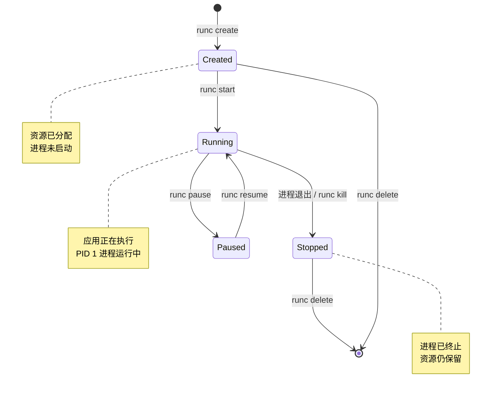

# 第三章：OCI 运行时规范与生命周期

> 深入理解容器运行时的工作机制，掌握不同 Runtime 的特点，学会配置和调优容器运行环境

容器技术的核心在于隔离与标准化。Open Container Initiative (OCI) 作为容器生态的关键组织，致力于制定开放的容器标准，其中最核心的便是 OCI 镜像规范（Image Specification）和 OCI 运行时规范（Runtime Specification）。本章将聚焦于后者，深入探讨 OCI 运行时规范如何定义容器的配置、执行环境以及生命周期管理。

OCI 运行时规范提供了一套标准化的方法，使得不同的容器运行时（如 runc、crun、kata-containers 等）能够按照统一的接口启动、停止和管理容器。这意味着只要一个容器镜像符合 OCI 镜像规范，并且其运行时配置符合 OCI 运行时规范，它就可以在任何支持 OCI 标准的运行时上被一致地执行。这种标准化极大地促进了容器生态系统的互操作性和创新。

本章将详细介绍 OCI 运行时规范的各个方面，包括其核心概念、配置文件的结构、容器生命周期管理，并对比主流的容器运行时实现。此外，我们还将探讨如何利用 AI 技术优化容器运行时的配置与管理。

## 3.1 Runtime 架构：runc, crun, kata-containers 对比

OCI 运行时规范定义了容器如何被创建、配置和管理，但具体的实现则由不同的运行时（Runtime）来完成。目前主流的 OCI 兼容运行时包括 runc、crun 和 Kata Containers，它们在设计理念、性能和安全隔离级别上有所不同。

### runc

`runc` 是 OCI 运行时规范的参考实现，由 Docker 公司捐献给 OCI。它是目前最广泛使用的容器运行时，也是许多高级容器管理工具（如 containerd 和 CRI-O）的底层核心。

*   **特点**:
    *   **低层级**: `runc` 直接与 Linux 内核交互，利用 cgroups、namespaces 等内核特性实现容器的隔离和资源限制。
    *   **高性能**: 由于其轻量级和直接的内核交互，`runc` 提供了非常低的启动延迟和高性能。
    *   **安全性**: 依赖于 Linux 内核的安全特性，但容器与宿主机共享同一个内核。这意味着如果内核存在漏洞，容器也可能受到影响。
    *   **实现语言**: Go 语言。
    *   **使用场景**: 适用于对性能要求高、安全性要求相对宽松（相对于虚拟机）的场景，是多数 Docker 和 Kubernetes 环境的默认运行时。

### crun

`crun` 是一个用 C 语言编写的 OCI 运行时，旨在提供比 `runc` 更小、更快、内存占用更低的替代方案。它与 `runc` 实现了相同的 OCI 运行时规范，并且在功能上保持兼容。

*   **特点**:
    *   **轻量级与高性能**: C 语言的特性使得 `crun` 在二进制大小和内存占用方面通常优于 `runc`。在某些场景下，启动速度也可能更快。
    *   **安全性**: 与 `runc` 类似，依赖于 Linux 内核的安全特性，隔离级别相同。
    *   **实现语言**: C 语言。
    *   **使用场景**: 适用于资源受限的环境、嵌入式系统，以及对启动速度和内存效率有极致追求的场景。它可以作为 `runc` 的直接替代品。

### Kata Containers

`Kata Containers` 是一个开源项目，旨在通过轻量级虚拟机（Lightweight Virtual Machines, LVN）来提供更强的容器隔离性，同时保持容器的速度和管理便利性。它结合了虚拟机（VM）的强隔离性和容器的敏捷性。

*   **特点**:
    *   **强隔离性**: 每个 Kata 容器都在一个独立的轻量级虚拟机中运行，拥有独立的内核。这提供了比 `runc`/`crun` 更强的安全隔离，因为容器之间以及容器与宿主机之间存在硬件虚拟化层的隔离。
    *   **兼容性**: 它兼容 OCI 运行时规范和 Kubernetes CRI (Container Runtime Interface)，可以无缝集成到现有的容器生态系统中。
    *   **资源开销**: 相较于 `runc`/`crun`，由于引入了虚拟机层，Kata Containers 会有略高的资源开销（内存和 CPU），但通常远低于传统虚拟机。
    *   **实现语言**: Go 和 Rust（针对其轻量级 Hypervisor）。
    *   **使用场景**: 适用于需要更高安全隔离的场景，如多租户云环境、运行不受信任工作负载、或者对数据安全有严格要求的企业级应用。

### 对比总结

| 特性         | runc                  | crun                   | Kata Containers              |
| :----------- | :-------------------- | :--------------------- | :--------------------------- |
| **隔离级别** | 共享宿主机内核（namespace/cgroups） | 共享宿主机内核（namespace/cgroups） | 独立轻量级虚拟机（硬件虚拟化） |
| **安全性**   | 依赖 Linux 内核安全缺陷 | 依赖 Linux 内核安全缺陷 | 更高，硬件隔离 |
| **性能**     | 高，低启动延迟        | 极高，更低资源占用     | 良好，略高于 runc/crun      |
| **资源消耗** | 低                    | 更低                   | 略高                       |
| **实现语言** | Go                    | C                      | Go, Rust (Hypervisor)        |
| **适用场景** | 多数 Docker/Kubernetes 环境 | 资源受限、追求极致性能     | 高安全隔离、多租户云环境     |

选择哪种运行时取决于具体的应用场景需求，平衡性能、资源消耗和安全隔离级别。

## 3.2 容器生命周期管理：create, start, kill, delete 流程

OCI 运行时规范不仅定义了容器的配置格式（通过 `config.json`），还标准化了容器的生命周期管理操作。这些操作确保了容器可以在不同的 OCI 运行时之间以一致的方式被创建、启动、停止和删除。核心操作包括 `create`、`start`、`kill` 和 `delete`。

### create (创建容器)

`create` 操作是容器生命周期的第一步，它根据 OCI 运行时配置（`config.json`）创建一个容器的运行环境，但并不启动其中的进程。

*   **过程**:
    1.  运行时接收到一个容器 ID 和 OCI 配置文件的路径。
    2.  根据 `config.json` 中的配置，创建必要的 Linux namespace（如 PID, UTS, Mount, IPC, Network, User namespace）。
    3.  设置 cgroups 来限制和隔离容器的资源（CPU, 内存, I/O 等）。
    4.  准备容器的文件系统，通常通过挂载一个符合 OCI 镜像规范的 rootfs。
    5.  设置网络接口（如果配置了）。
    6.  创建容器的进程，但使其处于暂停状态，不执行用户定义的命令。这个进程通常是一个“占位符”进程，用于在容器的命名空间中持有资源。
    7.  将容器的状态写入一个运行时可访问的地方（通常是一个 JSON 文件），包含容器 ID、bundle 路径、PID（如果已创建），以及当前状态（例如 `created`）。
*   **状态**: 容器进入 `created` 状态。此时，容器的资源已被分配和隔离，但其中的应用程序尚未运行。

### start (启动容器)

`start` 操作用于启动一个已经通过 `create` 操作创建的容器，执行其 `config.json` 中定义的用户进程。

*   **过程**:
    1.  运行时接收到容器 ID。
    2.  查找对应容器的状态信息。
    3.  在之前 `create` 阶段准备好的容器环境中，执行 `config.json` 中 `process` 字段定义的命令（例如 `/bin/sh` 或应用程序的入口点）。
    4.  将容器的状态更新为 `running`。
*   **状态**: 容器进入 `running` 状态。此时，容器内的应用程序开始执行。

### kill (发送信号给容器进程)

`kill` 操作用于向容器中的主进程发送一个指定的信号。这通常用于优雅地停止容器中的应用程序。

*   **过程**:
    1.  运行时接收到容器 ID 和要发送的信号（例如 SIGTERM, SIGKILL）。
    2.  查找对应容器的主进程 PID。
    3.  向该 PID 发送指定的信号。
*   **状态**: 容器的状态通常保持 `running`，直到接收到 SIGTERM 或 SIGKILL 信号的应用程序自行退出，或者运行时检测到主进程已终止。信号本身并不会立即改变 OCI 运行时层面的容器状态，而是影响容器内部的进程行为。

### delete (删除容器)

`delete` 操作用于销毁容器的运行时环境，释放所有与容器相关的资源（如 namespace、cgroups、挂载点、网络配置等）。

*   **过程**:
    1.  运行时接收到容器 ID。
    2.  如果容器仍在运行，运行时会先尝试停止容器进程（通常通过发送 SIGKILL）。
    3.  卸载所有与容器相关的挂载点。
    4.  删除 cgroups。
    5.  清理网络配置。
    6.  删除容器的运行时状态文件和目录。
*   **状态**: 容器从 `stopped` 状态（如果之前是运行状态并被停止）转变为完全被删除，不再存在于运行时中。

### 容器生命周期概览



一个典型的 OCI 容器生命周期流程如下：

1.  **准备**: 用户提供 OCI 镜像和 OCI 运行时配置 `config.json`。
2.  **创建**: 容器运行时执行 `runc create <container-id>`，容器进入 `created` 状态。
3.  **启动**: 容器运行时执行 `runc start <container-id>`，容器进入 `running` 状态。
4.  **停止/终止**:
    *   用户执行 `runc kill <container-id> <SIGNAL>` 发送信号。
    *   如果应用程序响应信号并退出，容器进程终止，容器状态可能变为 `stopped`。
    *   如果应用程序无响应，可能需要发送更强的信号（如 SIGKILL）。
5.  **删除**: 容器运行时执行 `runc delete <container-id>`，容器资源被清理。

**完整命令示例**：

```bash
# 1. 创建容器（但不启动）
$ sudo runc create mycontainer
# 容器状态: created

# 2. 查看状态
$ sudo runc state mycontainer
{
  "id": "mycontainer",
  "pid": 12345,
  "status": "created",
  "bundle": "/path/to/bundle"
}

# 3. 启动容器
$ sudo runc start mycontainer
# 容器状态: running

# 4. 发送信号（优雅停止）
$ sudo runc kill mycontainer SIGTERM

# 5. 强制停止（如果未响应）
$ sudo runc kill mycontainer SIGKILL
# 容器状态: stopped

# 6. 删除容器
$ sudo runc delete mycontainer
```

通过这组标准化的操作，OCI 运行时规范确保了容器管理工具可以以可预测和一致的方式与不同的容器运行时交互。

## 3.3 Config.json 详解：Namespaces, Cgroups, Capabilities 配置

`config.json` 是 OCI 运行时规范的核心文件，它以 JSON 格式定义了容器的配置和行为。这个文件描述了容器进程的各个方面，包括其执行环境、资源限制、安全特性以及文件系统设置等。理解 `config.json` 的结构和内容对于精确控制容器的运行时行为至关重要。

### `config.json` 的基本结构

一个典型的 `config.json` 文件包含以下主要部分：

*   **`ociVersion`**: OCI 运行时规范的版本。
*   **`process`**: 定义容器中运行的主进程。
    *   `terminal`: 是否分配 TTY。
    *   `user`: 进程的用户和组 ID。
    *   `args`: 进程的命令行参数。
    *   `env`: 环境变量。
    *   `cwd`: 工作目录。
    *   `capabilities`: Linux 能力（Capabilities）配置。
    *   `rlimits`: 资源限制。
*   **`root`**: 定义容器的根文件系统。
    *   `path`: rootfs 的路径。
    *   `readonly`: 是否只读。
*   **`hostname`**: 容器的主机名。
*   **`mounts`**: 容器内的挂载点。
*   **`linux`**: 针对 Linux 特有的配置。
    *   `namespaces`: Linux 命名空间配置。
    *   `cgroups`: cgroups 资源限制。
    *   `devices`: 设备配置。
    *   `seccomp`: Seccomp 过滤规则。
    *   `apparmor`: AppArmor 配置。
    *   `selinuxLabel`: SELinux 标签。

下面我们将重点解析 `namespaces`、`cgroups` 和 `capabilities` 这三个关键配置项。

### Namespaces (命名空间)

Linux Namespaces 是容器实现隔离的基石。通过为每个容器提供独立的系统资源视图，Namespaces 使得容器中的进程无法感知或影响宿主机以及其他容器的同类资源。`config.json` 中的 `linux.namespaces` 字段用于配置容器使用的命名空间。

常见的 Linux Namespaces 包括：

*   **`pid` (Process ID)**: 隔离进程 ID 空间。容器内部的进程有独立的 PID 序列，容器内的 PID 1 进程对应宿主机上的一个真实 PID。
*   **`net` (Network)**: 隔离网络接口、IP 地址、路由表、端口等。每个容器可以有自己的网络栈。
*   **`ipc` (Inter-Process Communication)**: 隔离 System V IPC（如消息队列、信号量）和 POSIX 消息队列。
*   **`mnt` (Mount)**: 隔离文件系统挂载点。容器可以有自己的文件系统层次结构，而不会影响宿主机。
*   **`uts` (UNIX Time-sharing System)**: 隔离主机名和域名。每个容器可以有自己的主机名。
*   **`user` (User ID)**: 隔离用户和组 ID 空间。容器内部的用户 ID 可以映射到宿主机上的不同用户 ID，增强安全性。

**`config.json` 示例:**

```json
"linux": {
    "namespaces": [
        {
            "type": "pid"
        },
        {
            "type": "network"
        },
        {
            "type": "ipc"
        },
        {
            "type": "mount"
        },
        {
            "type": "uts"
        },
        {
            "type": "user"
        }
    ]
}
```

每个 Namespace 类型都可以选择是否启用，或者通过 `path` 字段加入到已有的命名空间中。

### Cgroups (控制组)

Cgroups (Control Groups) 是 Linux 内核提供的另一种重要机制，用于限制、记录和隔离进程组（即容器）的资源使用。通过 cgroups，可以为容器分配 CPU 时间、内存、磁盘 I/O 和网络带宽等资源，防止单个容器耗尽系统资源。`config.json` 中的 `linux.cgroups` 字段用于配置 cgroups。

`cgroups` 配置通常包括：

*   **`cpu`**: CPU 资源限制。
    *   `shares`: CPU 份额（相对权重）。
    *   `quota`: CPU 配额（在一个周期内允许的最大 CPU 时间）。
    *   `period`: CPU 周期。
    *   `cpus`: 允许使用的 CPU 核心列表或范围。
*   **`memory`**: 内存资源限制。
    *   `limit`: 内存限制（字节）。
    *   `swap`: 交换空间限制。
    *   `kernel`: 内核内存限制。
*   **`blkio`**: 块设备 I/O 限制。
*   **`pids`**: 进程数量限制。
*   **`devices`**: 设备访问控制。

**`config.json` 示例 (部分):**

```json
"linux": {
    "cgroups": {
        "cpu": {
            "shares": 1024,
            "quota": 100000,
            "period": 100000
        },
        "memory": {
            "limit": 536870912 // 512 MB
        },
        "pids": {
            "limit": 2048
        }
    }
}
```

这些配置项允许管理员对容器的资源使用进行精细控制，确保系统的稳定性和公平性。

### Capabilities (能力)

Linux Capabilities 是对传统超级用户（root）权限的细粒度划分。在容器中，通常不建议以完整的 root 权限运行进程，因为这会带来巨大的安全风险。Capabilities 允许进程只拥有其完成特定任务所需的最小权限子集。`config.json` 中的 `process.capabilities` 字段用于配置容器进程的能力。

常用的 Capabilities 包括：

*   **`CAP_NET_BIND_SERVICE`**: 允许绑定到小于 1024 的特权端口。
*   **`CAP_NET_RAW`**: 允许使用 RAW 和 PACKET 套接字。
*   **`CAP_SYS_CHROOT`**: 允许使用 `chroot()` 系统调用。
*   **`CAP_AUDIT_WRITE`**: 允许写入内核审计日志。
*   **`CAP_KILL`**: 允许向任意进程发送信号。

`config.json` 中可以定义 `effective`、`permitted`、`inheritable`、`bounding` 和 `ambient` 集合。通常，我们关注 `effective` 和 `permitted`。

**`config.json` 示例:**

```json
"process": {
    "capabilities": {
        "bounding": [
            "CAP_CHOWN",
            "CAP_DAC_OVERRIDE",
            // ... 其他能力
        ],
        "effective": [
            "CAP_CHOWN",
            "CAP_DAC_OVERRIDE",
            // ... 其他能力
        ],
        "inheritable": [
            "CAP_CHOWN",
            "CAP_DAC_OVERRIDE",
            // ... 其他能力
        ],
        "permitted": [
            "CAP_CHOWN",
            "CAP_DAC_OVERRIDE",
            // ... 其他能力
        ],
        "ambient": [
            "CAP_CHOWN",
            "CAP_DAC_OVERRIDE",
            // ... 其他能力
        ]
    }
}
```

最佳实践是遵循“最小权限原则”，只为容器进程授予其正常运行所需的最小 Capabilities，以减少潜在的攻击面。

### 总结

`config.json` 是 OCI 运行时规范中定义容器行为的蓝图。通过对 `namespaces` 实现隔离、`cgroups` 限制资源、`capabilities` 细化权限，`config.json` 为容器提供了强大而灵活的控制机制，是构建安全、高效容器运行环境的关键。

## 3.4 实战：使用 runc 手动运行容器

`runc` 是 OCI 运行时规范的参考实现，允许我们直接操作容器。本节将通过一个简单的示例，演示如何使用 `runc` 手动创建一个 OCI bundle 并运行一个容器。

### 准备工作

1.  **安装 runc**:
    如果您的系统上没有 `runc`，可以从其 GitHub 仓库 [https://github.com/opencontainers/runc](https://github.com/opencontainers/runc) 获取并安装。通常，通过包管理器安装 Docker 或 containerd 也会附带安装 `runc`。
    ```bash
    # 例如，在 Ubuntu/Debian 上
    sudo apt-get update
    sudo apt-get install runc

    # 或者从 GitHub 下载并编译
    # git clone https://github.com/opencontainers/runc
    # cd runc
    # make
    # sudo make install
    ```

2.  **准备 Root Filesystem (rootfs)**:
    容器需要一个根文件系统。我们可以使用 `docker export` 命令从一个已有的 Docker 镜像中导出 rootfs，或者手动创建一个。这里我们以导出 busybox 镜像为例：

    ```bash
    # 确保已安装 Docker
    docker pull busybox
    mkdir mycontainer
    docker export $(docker create busybox) > mycontainer/busybox.tar
    tar -xf mycontainer/busybox.tar -C mycontainer/rootfs
    rm mycontainer/busybox.tar
    ```
    现在 `mycontainer/rootfs` 目录就是我们的容器根文件系统。

### 生成 OCI 配置文件 (config.json)

进入 `mycontainer` 目录，并使用 `runc spec` 命令生成 `config.json` 模板：

```bash
cd mycontainer
runc spec
```

这会在 `mycontainer` 目录下生成一个默认的 `config.json` 文件。这个文件是 OCI 运行时规范的实现，描述了容器的配置。

### 修改 `config.json`

打开生成的 `config.json` 文件。通常，默认配置已经足够运行一个简单的容器。但我们可以做一些调整，例如修改 `process.args` 来指定容器启动时执行的命令。

找到 `process` 部分，将 `args` 修改为 `/bin/sh`，这样我们就可以进入容器的 shell。

```json
"process": {
    "terminal": true,
    "user": {
        "uid": 0,
        "gid": 0
    },
    "args": [
        "sh" // 将这里改为 "sh"
    ],
    // ... 其他配置
},
```

### 运行容器

现在我们已经有了一个 OCI bundle（包含 `config.json` 和 `rootfs` 目录），可以使用 `runc` 来运行容器了。

1.  **创建容器**:
    `create` 命令会根据 `config.json` 创建容器的运行时环境，但不启动其中的进程。
    ```bash
    sudo runc create mybusybox
    ```
    这里的 `mybusybox` 是容器的 ID，可以随意指定一个唯一的名称。

2.  **启动容器**:
    `start` 命令会启动已创建容器中的主进程。
    ```bash
    sudo runc start mybusybox
    ```
    此时，您会进入 `busybox` 容器的 shell。您可以在里面执行一些命令，如 `ls /`、`ps aux` 等，观察容器内部的隔离环境。

3.  **退出容器**:
    在容器 shell 中输入 `exit` 或按下 `Ctrl+D` 即可退出。

4.  **查看容器状态**:
    ```bash
    sudo runc list
    ```
    您会看到 `mybusybox` 容器的状态可能是 `stopped` 或 `exited`。

5.  **删除容器**:
    `delete` 命令会清理容器所占用的资源。
    ```bash
    sudo runc delete mybusybox
    ```
    **注意**: 必须先停止或退出容器，才能删除它。

### 简化运行：`runc run`

`runc` 也提供了一个 `run` 命令，它等同于 `create` 和 `start` 的组合，可以一步到位地创建并启动容器。

```bash
sudo runc run mybusybox_single
```
这里 `mybusybox_single` 是另一个容器 ID。

### 总结

通过本实战，我们了解了 `runc` 如何根据 OCI 运行时规范，通过 `config.json` 和 `rootfs` 手动创建、启动、管理和删除容器。这有助于我们更深入地理解容器的底层工作原理，以及 OCI 标准在其中的作用。

## 3.5 AI 赋能：智能生成与校验 Runtime 配置

随着容器化应用的日益复杂和规模的不断扩大，手动配置和管理 OCI 运行时（Runtime）的 `config.json` 文件变得越来越具有挑战性。配置错误可能导致安全漏洞、性能问题甚至容器无法启动。人工智能（AI）技术，特别是大型语言模型（LLM）和机器学习，为智能生成、优化和校验 Runtime 配置提供了新的机遇。

### 1. 智能生成 `config.json`

传统的 `config.json` 生成通常依赖于模板、命令行工具（如 `runc spec`）或高级编排工具（如 Kubernetes、Docker Compose）。AI 可以通过以下方式增强这一过程：

*   **基于意图的配置生成**: 用户可以通过自然语言描述其需求（例如，“我需要一个内存限制为 512MB，CPU 份额为 0.5，且能够访问网络的应用容器”），AI 模型可以解析这些意图，并生成符合 OCI 规范的 `config.json` 文件。这降低了对用户 OCI 规范细节的认知负担。
*   **最佳实践推荐**: AI 可以学习大量的生产环境配置数据，识别常见模式和最佳实践。在生成配置时，它可以根据应用类型、安全等级、性能要求等因素，自动推荐或应用符合最佳实践的配置项，例如，移除不必要的 capabilities、设置合理的 seccomp 规则等。
*   **上下文感知生成**: 如果 AI 模型能够访问项目的其他元数据（如 Dockerfile、Kubernetes YAML、代码库依赖），它可以更智能地推断出所需的配置。例如，识别应用可能需要哪些端口、哪些文件系统路径需要挂载、哪些环境变量是必需的。

### 2. 自动化校验与优化

生成的 `config.json` 并非总是完美的，AI 可以在配置投入生产之前对其进行自动化校验和优化。

*   **合规性校验**: AI 模型可以被训练来理解 OCI 运行时规范的细则以及各种安全标准（如 CIS Benchmarks）。它可以自动检查生成的 `config.json` 是否符合规范要求，是否存在已知的安全漏洞或不安全的配置模式。
*   **性能优化建议**: 通过分析应用的运行时指标和历史配置数据，AI 可以识别配置中可能存在的性能瓶颈。例如，如果发现某个应用的 CPU 限制过低导致频繁达到上限，AI 可以建议增加 CPU quota。
*   **资源利用率分析与优化**: AI 可以预测不同 `cgroups` 配置对资源利用率的影响。例如，对于弹性工作负载，AI 可以建议动态调整 CPU 和内存限制，以在满足性能需求的同时最大化资源利用率。
*   **异常检测与风险评估**: AI 可以持续监控运行中容器的 `config.json`，并与基线配置进行比较，检测任何未经授权的修改或异常配置。对于不符合安全策略的配置，AI 可以自动标记并发出警报。

### 3. AI 驱动的运行时安全

AI 在 Runtime 配置中的应用也可以显著提升容器的安全性。

*   **最小权限原则强化**: AI 可以分析应用的行为模式，并推荐满足应用运行所需的最少 Capabilities 集合，避免授予不必要的特权。
*   **动态安全策略**: 结合运行时行为分析，AI 可以创建和更新动态 Seccomp 或 AppArmor 策略，以适应应用在不同阶段的行为变化，提供更精细的隔离。
*   **漏洞缓解**: 当新的内核漏洞或运行时漏洞被发现时，AI 可以迅速分析当前配置，并建议临时的缓解措施，例如调整 cgroups、namespaces 或 capabilities，以降低风险。

### 挑战与展望

尽管 AI 在 Runtime 配置方面潜力巨大，但也面临一些挑战：

*   **数据依赖**: AI 模型的有效性高度依赖于高质量的训练数据，包括各种合规、非合规、优化和非优化的 `config.json` 示例及其相关的运行时行为数据。
*   **解释性**: AI 推荐的配置有时可能缺乏透明度，理解 AI 为什么做出某个建议对于信任和调试至关重要。
*   **复杂性管理**: OCI 规范本身就很复杂，AI 需要能够处理这种复杂性，并将其转化为易于理解和操作的配置。

未来，随着 AI 技术的发展，我们可以预见到更加智能化和自动化的 OCI 运行时配置管理系统。这些系统将能够持续学习、适应和优化容器的运行时环境，从而构建更安全、更高效、更易于管理的云原生基础设施。
