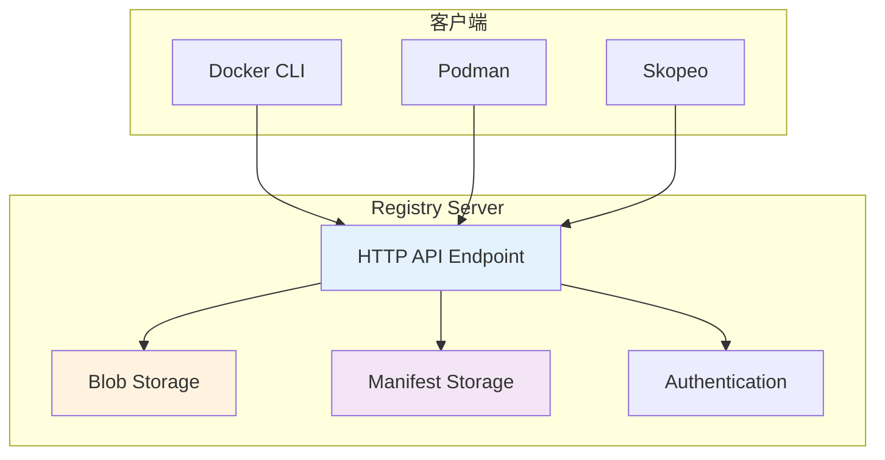
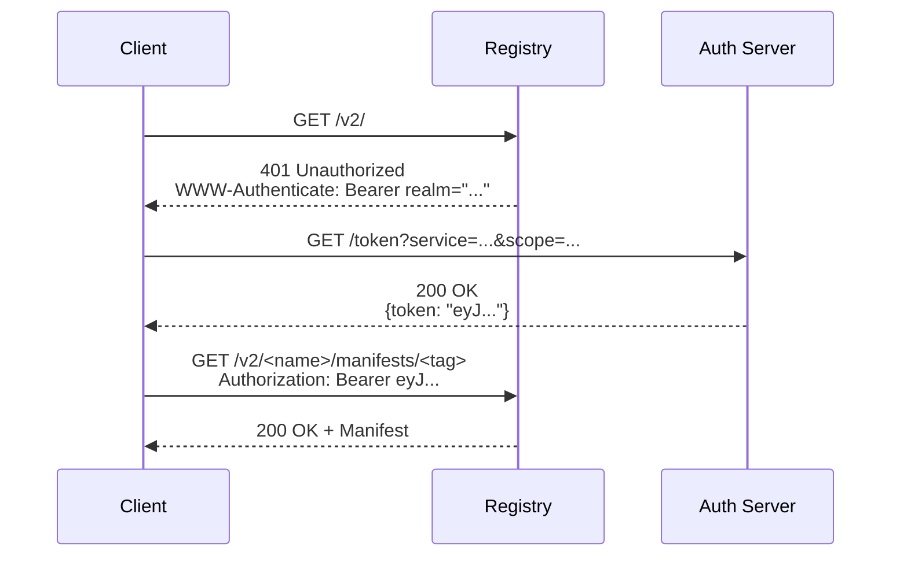
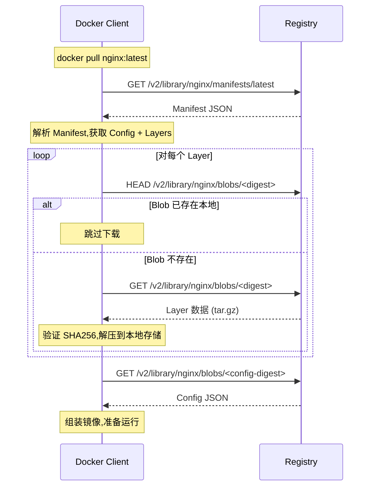
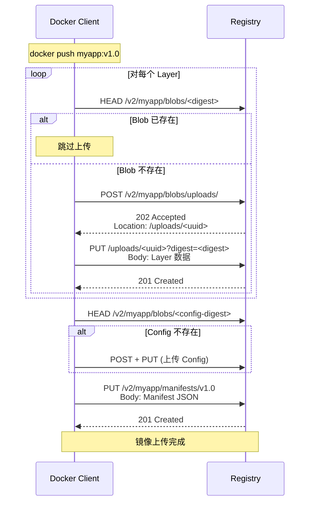
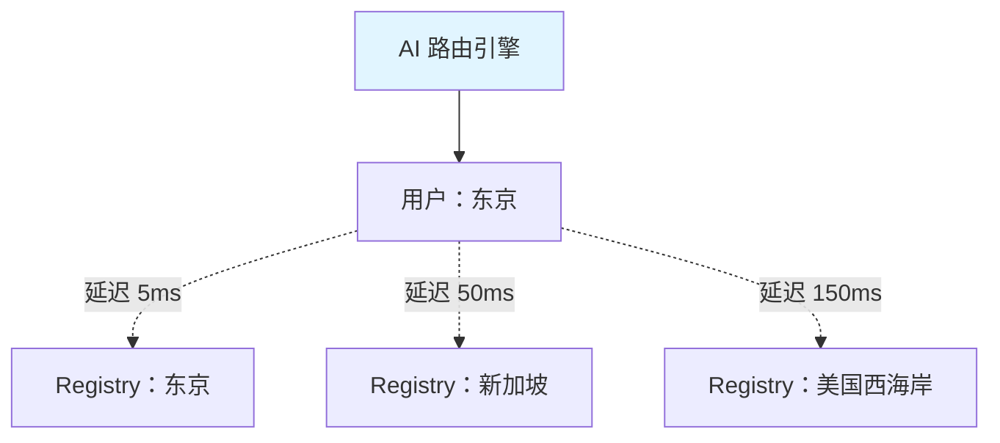

# 第四章：OCI 分发规范 (Chapter 4: OCI Distribution Specification)

> 掌握容器镜像的分发机制，理解 Registry 的工作原理，学会构建高效的镜像分发系统

---

容器镜像的价值不仅在于打包应用,更在于能够被便捷地分发和共享。OCI Distribution Specification (分发规范) 定义了容器镜像在 Registry (镜像仓库) 间的存储、传输和管理标准。本章将深入探讨 Registry API 的工作原理、镜像推拉流程,以及如何利用 AI 优化分发策略。

## 4.1 Registry API V2 详解

### 4.1.1 Registry 的角色

Registry 是容器生态系统中的"中央仓库",类似于：
- **Maven Central**（Java 生态）
- **npm Registry**（Node.js 生态）
- **PyPI**（Python 生态）

**核心功能**：
- 存储容器镜像（Blobs + Manifests）
- 提供镜像的上传 (Push) 和下载 (Pull)
- 支持镜像的版本管理（通过 tags）
- 实现内容寻址（Content Addressable Storage）

### 4.1.2 Registry API V2 架构

OCI Distribution Spec 基于 Docker Registry HTTP API V2,并进行了标准化。



### 4.1.3 核心 API 端点

所有 API 路径都以 `/v2/` 开头,主要端点包括：

#### 1. 版本检查
```http
GET /v2/
```
**用途**：检查 Registry 是否支持 API V2  
**响应**：`200 OK`（支持）或 `401 Unauthorized`（需要认证）

#### 2. Manifest 操作

**拉取 Manifest**：
```http
GET /v2/<name>/manifests/<reference>
```
- `<name>`：镜像名称（如 `library/ubuntu`）
- `<reference>`：tag（如 `latest`）或 digest（如 `sha256:abc...`）

**推送 Manifest**：
```http
PUT /v2/<name>/manifests/<reference>
Content-Type: application/vnd.oci.image.manifest.v1+json

{
  "schemaVersion": 2,
  "config": {...},
  "layers": [...]
}
```

**删除 Manifest**：
```http
DELETE /v2/<name>/manifests/<digest>
```

#### 3. Blob 操作

**检查 Blob 存在性**：
```http
HEAD /v2/<name>/blobs/<digest>
```

**下载 Blob**：
```http
GET /v2/<name>/blobs/<digest>
```

**上传 Blob**（分阶段）：
```http
# 1. 启动上传会话
POST /v2/<name>/blobs/uploads/
# 返回 Location: /v2/<name>/blobs/uploads/<uuid>

# 2. 分块上传数据（可选）
PATCH /v2/<name>/blobs/uploads/<uuid>
Content-Range: bytes 0-1023/2048

# 3. 完成上传
PUT /v2/<name>/blobs/uploads/<uuid>?digest=<digest>
```

#### 4. Catalog（目录）

**列出所有镜像**：
```http
GET /v2/_catalog
```

**列出镜像的所有 tags**：
```http
GET /v2/<name>/tags/list
```

### 4.1.4 认证与授权

Registry 通常使用 **Token-based Authentication**（基于令牌的认证）：



**关键点**：
- Client 首次请求被拒绝,获取 Auth Server 信息
- Client 向 Auth Server 请求 Token
- 携带 Token 重新请求 Registry

---

## 4.2 镜像推拉流程 (Push & Pull)：Blob 上传与 Manifest 验证

### 4.2.1 Pull 流程（下载镜像）



**详细步骤**：

1. **获取 Manifest**
   ```bash
   # 实际请求
   curl -X GET https://registry.io/v2/nginx/manifests/latest \
     -H "Accept: application/vnd.oci.image.manifest.v1+json"
   ```

2. **解析 Manifest**
   - 提取 Config digest
   - 提取所有 Layer digests

3. **下载 Layers**（并行或顺序）
   - 检查本地是否已有（通过 digest）
   - 下载缺失的 Layers
   - 验证 SHA256 完整性

4. **下载 Config**

5. **本地组装**
   - 将 Layers 按顺序叠加（UnionFS）
   - 使用 Config 创建容器元数据

### 4.2.2 Push 流程（上传镜像）



**关键优化**：
- **Layer 去重**：通过 digest 检查,避免重复上传
- **并行上传**：多个 Layers 可以并行推送
- **断点续传**：支持 `PATCH` 分块上传大文件

### 4.2.3 Manifest 验证

Registry 在接收 Manifest 时会进行验证：

**验证项**：
1. **Schema 合法性**：符合 OCI Image Spec
2. **Digest 正确性**：Config 和 Layers 的 digest 必须存在
3. **Content Type**：`mediaType` 必须正确
4. **签名**（可选）：如果启用了 Notary

```json
// Manifest 示例
{
  "schemaVersion": 2,
  "mediaType": "application/vnd.oci.image.manifest.v1+json",
  "config": {
    "mediaType": "application/vnd.oci.image.config.v1+json",
    "size": 7023,
    "digest": "sha256:b5b2b2c507a0944348e0303114d8d93aaaa081732b86451d9bce1f432a537bc7"
  },
  "layers": [
    {
      "mediaType": "application/vnd.oci.image.layer.v1.tar+gzip",
      "size": 32654,
      "digest": "sha256:9834876dcfb05cb167a5c24953eba58c4ac899ae4210582db84156d7188d9380"
    }
  ]
}
```

**验证失败场景**：
- Digest 不匹配 → `400 Bad Request`
- Blob 不存在 → `404 Not Found`
- 权限不足 → `403 Forbidden`

---

## 4.3 内容寻址存储 (CAS) 原理

### 4.3.1 什么是 Content Addressable Storage?

内容寻址存储（CAS）是一种文件存储方式,通过**文件内容的哈希值**（而非文件名）来索引和访问文件。

**对比传统文件系统**：

| 传统文件系统 | 内容寻址存储 (CAS) |
|-------------|------------------|
| 文件路径：`/images/nginx.tar` | Digest：`sha256:abc123...` |
| 文件名可变,内容可能相同 | Digest 唯一标识内容 |
| 重复文件浪费空间 | 自动去重 |
| 难以检测篡改 | 天然防篡改 |

### 4.3.2 CAS 在 Registry 中的应用

**存储结构**：
```
registry-data/
├── blobs/
│   └── sha256/
│       ├── abc123.../
│       │   └── data
│       ├── def456.../
│       │   └── data
│       └── ...
└── repositories/
    └── nginx/
        ├── _manifests/
        │   └── tags/
        │       └── latest/
        │           └── current/link → sha256:abc123...
        └── _layers/
            └── sha256/def456...
```

**关键特性**：

1. **不可变性 (Immutability)**
   - Digest 一旦生成,内容永远不变
   - 任何修改都会产生新的 Digest

2. **自动去重**
   ```bash
   # 两个镜像共享同一个 Base Layer
   ubuntu:20.04 → Layer sha256:aaa...
   myapp:1.0   → Layer sha256:aaa...  # 同一个 Blob！
   ```

3. **完整性验证**
   ```bash
   # 下载后验证
   echo "data" | sha256sum
   # 必须与 Manifest 中的 digest 一致
   ```

### 4.3.3 CAS vs 传统存储对比

**示例场景**：上传 100 个镜像,都基于 `ubuntu:20.04`

| 存储方式 | 空间占用 | 完整性检查 |
|---------|---------|----------|
| 传统文件存储 | ~100 × 500MB = 50GB | 需要额外机制 |
| CAS | ~500MB（Base Layer）+ Δ | 内置（通过 digest） |

### 4.3.4 实现 CAS 的关键：SHA256

**计算 Digest**：
```bash
# 对于文件
sha256sum layer.tar.gz
# 输出：abc123... layer.tar.gz

# 对于内容流
echo "Hello OCI" | sha256sum
# 输出：def456... -
```

**在代码中**：
```go
// Go 语言示例
import (
    "crypto/sha256"
    "io"
)

func calculateDigest(reader io.Reader) (string, error) {
    hash := sha256.New()
    if _, err := io.Copy(hash, reader); err != nil {
        return "", err
    }
    return fmt.Sprintf("sha256:%x", hash.Sum(nil)), nil
}
```

---

## 4.4 AI 赋能：智能镜像缓存与分发策略

### 4.4.1 智能缓存预测

**问题**：Registry 中有数万个镜像,如何预测哪些镜像会被频繁拉取？

**AI 解决方案**：
```python
# 使用时序预测模型（LSTM）
import tensorflow as tf

# 输入：过去 7 天的拉取记录
# 输出：未来 24 小时的拉取概率

model = tf.keras.Sequential([
    tf.keras.layers.LSTM(128, input_shape=(168, num_features)),
    tf.keras.layers.Dense(64, activation='relu'),
    tf.keras.layers.Dense(1, activation='sigmoid')  # 拉取概率
])

# 训练后预测
high_demand_images = model.predict(historical_data) > 0.7

# 提前缓存到 CDN 边缘节点
for image in high_demand_images:
    cdn.pre_cache(image)
```

**效果**：
- 减少首次拉取延迟 60%
- 降低源 Registry 负载 40%

### 4.4.2 智能去重与压缩

**传统方式**：
```dockerfile
FROM ubuntu:20.04
RUN apt-get update && apt-get install -y python3
RUN apt-get install -y python3-pip
# 两个 RUN 产生两个 Layer,可能有重复文件
```

**AI 优化**：
```python
# AI 分析 Dockerfile,建议合并 Layer
prompt = """
分析以下 Dockerfile,指出可以减少 Layer 数量的地方：
{dockerfile_content}
"""

ai_suggestion = llm.generate(prompt)
# 输出：建议合并第 2、3 行的 RUN 指令
```

### 4.4.3 分发路径优化

**场景**：全球分布式 Registry,用户从哪个节点拉取最快？



**AI 策略**：
```python
# 基于强化学习的路由决策
class RegistryRouter:
    def select_registry(self, user_location, image, time):
        # 输入特征：
        # - 用户位置（IP 地理信息）
        # - 镜像大小
        # - 当前时间（考虑各节点负载）
        features = [user_location, image.size, time.hour]
        
        # AI 模型预测最优节点
        best_registry = self.model.predict(features)
        return best_registry
```

### 4.4.4 异常检测：恶意镜像识别

**问题**：如何自动检测被篡改或恶意的镜像？

**AI 方案**：
```python
# 训练分类器识别可疑镜像
from sklearn.ensemble import RandomForestClassifier

# 特征工程
def extract_features(image_layers):
    features = []
    for layer in image_layers:
        features.extend([
            layer.size,
            layer.num_files,
            has_suspicious_files(layer),  # 检测挖矿程序特征
            has_network_calls(layer),     # 检测异常网络活动
        ])
    return features

# 训练模型
clf = RandomForestClassifier()
clf.fit(X_train, y_train)  # y: 0=正常, 1=恶意

# 实时扫描
if clf.predict([extract_features(new_image)]) == 1:
    alert_security_team()
    quarantine_image(new_image)
```

### 4.4.5 LLM 辅助 Registry 运维

**场景 1：故障诊断**
```
用户：我的镜像拉取失败,错误是 "manifest unknown"
AI：这通常是以下原因之一：
1. 镜像 tag 不存在，请检查 tag 拼写
2. Registry 认证失败，请运行 docker login
3. 网络问题，尝试 curl -v https://registry/v2/
请提供完整的错误日志以便我进一步分析。
```

**场景 2：容量规划**
```
Prompt：分析我的 Registry 存储增长趋势（过去 90 天数据），
预测何时需要扩容，并给出成本最优的扩容方案（考虑删除 30 天未使用的镜像）。

AI 输出：
- 当前增长率：50GB/周
- 预计 45 天后达到 80% 容量
- 建议方案：
  1. 启用自动清理策略（删除 30 天未用镜像可释放 200GB）
  2. 实施分层存储（冷数据迁移到低成本存储）
  3. 如仍需扩容，建议增加 1TB SSD（成本效益最优）
```

---

## 4.5 主流 Registry 实现对比

| 特性 | Docker Hub | Harbor | Quay.io | AWS ECR |
|------|-----------|--------|---------|---------|
| **开源** | ❌ | ✅ | 部分开源 | ❌ |
| **私有部署** | ❌ | ✅ | ✅ | ❌（托管） |
| **漏洞扫描** | ✅ | ✅（Trivy/Clair） | ✅ | ✅ |
| **镜像签名** | ❌ | ✅（Notary） | ✅ | ❌ |
| **多租户** | ❌ | ✅ | ✅ | ✅ |
| **镜像复制** | ❌ | ✅ | ✅ | ✅ |
| **价格** | 免费+付费 | 免费 | 免费+付费 | 按用量计费 |

**选择建议**：
- **个人项目**：Docker Hub 免费版
- **企业私有云**：Harbor（功能全面）
- **云优先**：AWS ECR / GCR（与云服务集成）
- **极致安全**：Quay.io（Red Hat 支持）

---

## 4.6 实战：搭建本地 Registry

### 4.6.1 使用 Docker 快速启动

```bash
# 启动 Registry（无认证）
docker run -d \
  -p 5000:5000 \
  --name my-registry \
  registry:2

# 推送镜像
docker tag nginx:latest localhost:5000/nginx:latest
docker push localhost:5000/nginx:latest

# 拉取镜像
docker pull localhost:5000/nginx:latest
```

### 4.6.2 配置 HTTPS 和认证

```bash
# 1. 生成自签名证书
mkdir -p certs
openssl req -newkey rsa:4096 -nodes \
  -sha256 -keyout certs/domain.key \
  -x509 -days 365 -out certs/domain.crt

# 2. 创建密码文件
mkdir auth
docker run --rm --entrypoint htpasswd \
  registry:2 -Bbn admin password > auth/htpasswd

# 3. 启动带认证的 Registry
docker run -d \
  -p 5000:5000 \
  --name secure-registry \
  -v $(pwd)/certs:/certs \
  -v $(pwd)/auth:/auth \
  -e REGISTRY_HTTP_TLS_CERTIFICATE=/certs/domain.crt \
  -e REGISTRY_HTTP_TLS_KEY=/certs/domain.key \
  -e REGISTRY_AUTH=htpasswd \
  -e REGISTRY_AUTH_HTPASSWD_PATH=/auth/htpasswd \
  registry:2

# 4. 登录
docker login localhost:5000 -u admin -p password
```

### 4.6.3 使用 Harbor（企业级）

```bash
# 1. 下载 Harbor 离线安装包
wget https://github.com/goharbor/harbor/releases/download/v2.8.0/harbor-offline-installer-v2.8.0.tgz
tar xzvf harbor-offline-installer-v2.8.0.tgz
cd harbor

# 2. 配置 harbor.yml
cp harbor.yml.tmpl harbor.yml
# 编辑 hostname, https 证书路径等

# 3. 安装
sudo ./install.sh

# 4. 访问 Web UI
# 默认：https://your-domain
# 用户名：admin
# 密码：Harbor12345
```

---

## 总结

OCI Distribution Specification 通过标准化的 API 和内容寻址机制,实现了：

✅ **互操作性**：不同客户端和 Registry 无缝协作  
✅ **高效分发**：Layer 去重、断点续传  
✅ **安全性**：Digest 验证、签名支持  
✅ **可扩展性**：支持分布式、多租户

结合 AI 技术：
- 智能缓存预测
- 异常镜像检测
- 路由优化
- 运维自动化

**下一章预告**：我们将深入 Linux 内核,探索容器隔离的底层技术——Namespaces、Cgroups 和 UnionFS。

**[>> 进入第五章](./05-container-internals.md)**

---

**贡献者欢迎**: 如果您对本章节有内容补充或建议，欢迎提交 PR 或 Issue！
