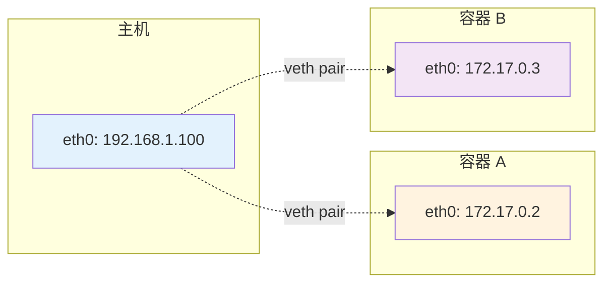
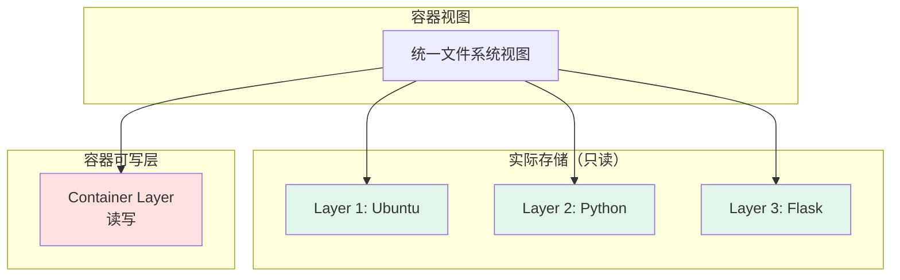
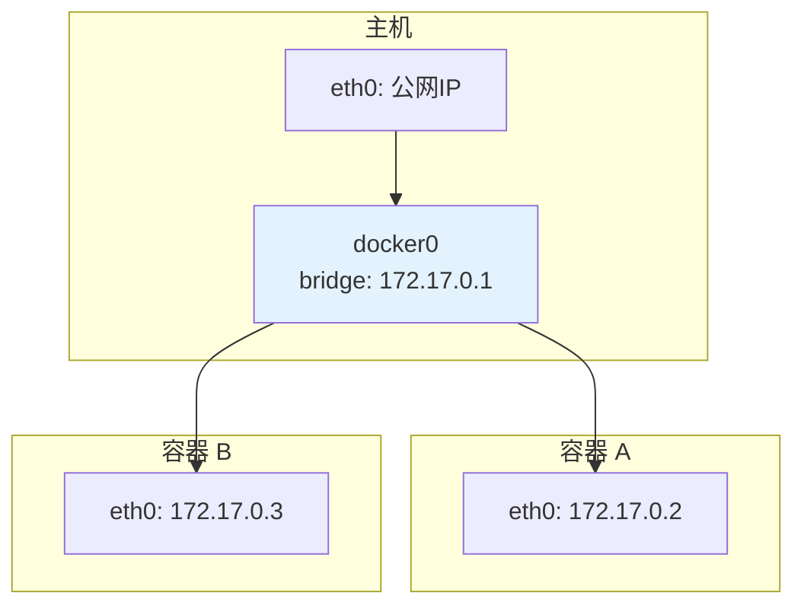
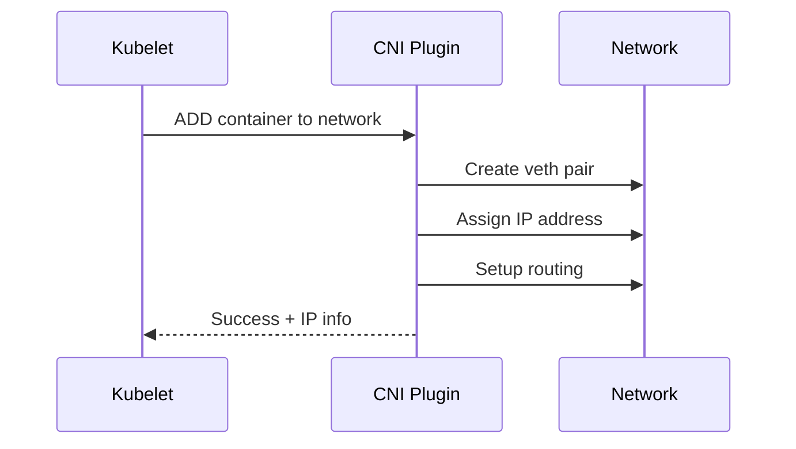
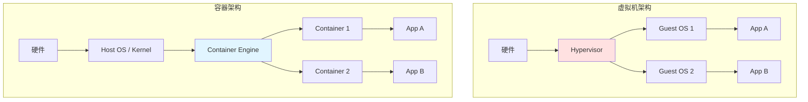

# 第五章：容器底层技术内幕 (Chapter 5: Container Internals)

> 揭秘容器隔离的本质，深入 Linux 内核机制，理解容器与虚拟机的根本区别

---

容器的"魔法"并非来自某个单一技术,而是 Linux 内核多项功能的精妙组合。本章将深入探讨支撑容器技术的四大基石：Namespaces(隔离)、Cgroups(资源限制)、UnionFS(文件系统)和 CNI(网络)。理解这些底层机制,你才能真正掌控容器的行为。

## 5.1 Linux Namespaces：隔离的艺术

### 5.1.1 什么是 Namespace?

Namespace 是 Linux 内核提供的一种资源隔离机制,使得进程只能看到和访问被分配给它的资源子集,从而创造出"独立环境"的假象。

**核心思想**：
> "同一台主机上的进程,可以拥有不同的'世界观'"

### 5.1.2 Namespace 类型

Linux 提供了 **8 种** Namespace（截至内核 5.6+）：

| Namespace | 隔离内容 | 引入版本 | Unshare Flag |
|-----------|---------|---------|--------------|
| **PID** | 进程 ID | 2.6.24 | `CLONE_NEWPID` |
| **NET** | 网络设备、IP、端口 | 2.6.29 | `CLONE_NEWNET` |
| **MNT** | 文件系统挂载点 | 2.4.19 | `CLONE_NEWNS` |
| **UTS** | 主机名和域名 | 2.6.19 | `CLONE_NEWUTS` |
| **IPC** | System V IPC、POSIX 消息队列 | 2.6.19 | `CLONE_NEWIPC` |
| **USER** | 用户和组 ID | 3.8 | `CLONE_NEWUSER` |
| **Cgroup** | Cgroup 根目录 | 4.6 | `CLONE_NEWCGROUP` |
| **Time** | 系统时钟 | 5.6 | `CLONE_NEWTIME` |

### 5.1.3 PID Namespace：进程隔离

**作用**：容器内的进程拥有独立的 PID 编号空间。

```bash
# 在主机上
$ ps aux | grep nginx
root  1234  nginx: master process

# 在容器内
$ ps aux
PID   USER     COMMAND
1     root     nginx: master process  # 容器内 PID 为 1
2     www-data nginx: worker process
```

**实现原理**：
```c
// 创建新的 PID Namespace
int pid = clone(child_func, child_stack, CLONE_NEWPID | SIGCHLD, NULL);

// 在新 Namespace 中，init 进程的 PID 为 1
```

**特性**：
- 容器内第一个进程 PID 为 1（充当 init）
- 父 Namespace 可以看到子 Namespace 的进程,反之不行
- 孤儿进程由容器内 PID 1 回收

**实验**：
```bash
# 使用 unshare 创建新 PID Namespace
sudo unshare --pid --fork --mount-proc /bin/bash

# 在新 shell 中
$ echo $$  # 输出 1
$ ps aux  # 只能看到容器内进程
```

### 5.1.4 NET Namespace：网络隔离

**作用**：为容器提供独立的网络栈（网卡、IP、路由表、iptables）。



**关键组件**：
- **veth pair**：虚拟网卡对,连接主机和容器
- **bridge**：虚拟交换机（如 docker0）

**实验**：
```bash
# 1. 创建 NET Namespace
sudo ip netns add container1

# 2. 在 Namespace 中执行命令
sudo ip netns exec container1 ip addr
# 只显示 lo（本地回环）

# 3. 创建 veth pair
sudo ip link add veth0 type veth peer name veth1

# 4. 将 veth1 放入 Namespace
sudo ip link set veth1 netns container1

# 5. 配置 IP
sudo ip netns exec container1 ip addr add 10.1.1.2/24 dev veth1
sudo ip netns exec container1 ip link set veth1 up
```

### 5.1.5 MNT Namespace：文件系统隔离

**作用**：每个容器拥有独立的文件系统视图。

```bash
# 主机上 /proc
$ ls /proc
1  2  3  cpuinfo  meminfo  ...

# 容器内 /proc（重新挂载）
$ ls /proc
1  self  cpuinfo  meminfo  ...
```

**chroot vs MNT Namespace**：

| 特性 | chroot | MNT Namespace |
|------|--------|--------------|
| 改变根目录 | ✅ | ✅ |
| 隔离挂载点 | ❌ | ✅ |
| 阻止 chroot 逃逸 | ❌ | ✅ |

### 5.1.6 USER Namespace：用户隔离

**强大功能**：容器内的 `root` ≠ 主机 `root`

```bash
# 容器内
$ id
uid=0(root) gid=0(root) groups=0(root)

# 主机上（映射后）
$ ps aux | grep container_process
1000  12345  container_process  # 实际 UID 为 1000
```

**UID/GID 映射**：
```bash
# 配置 /etc/subuid 和 /etc/subgid
$ cat /etc/subuid
user1:100000:65536  # 容器内 0-65535 映射到主机 100000-165535
```

### 5.1.7 实战：手动创建 Namespace

```go
// Go 语言示例：创建多个 Namespace
package main

import (
    "os"
    "os/exec"
    "syscall"
)

func main() {
    cmd := exec.Command("/bin/bash")
    cmd.Stdin = os.Stdin
    cmd.Stdout = os.Stdout
    cmd.Stderr = os.Stderr
    
    // 设置 Namespace 隔离
    cmd.SysProcAttr = &syscall.SysProcAttr{
        Cloneflags: syscall.CLONE_NEWPID |
                    syscall.CLONE_NEWNET |
                    syscall.CLONE_NEWNS |
                    syscall.CLONE_NEWUTS,
    }
    
    if err := cmd.Run(); err != nil {
        panic(err)
    }
}
```

---

## 5.2 Cgroups V1 vs V2：资源限制与监控

### 5.2.1 什么是 Cgroups?

**Control Groups (Cgroups)** 是 Linux 内核用于限制、记录和隔离进程组资源使用（CPU、内存、磁盘 I/O）的机制。

**与 Namespace 的区别**：
- **Namespace**：隔离资源**视图**
- **Cgroups**：限制资源**使用量**

### 5.2.2 Cgroups V1 架构

**核心概念**：
- **Subsystem (子系统)**：每种资源类型（如 `cpu`, `memory`）
- **Hierarchy (层级)**：树状结构组织 cgroup
- **cgroup**：一组进程+资源限制配置

**主要子系统**：

| 子系统 | 功能 | 配置文件 |
|--------|------|---------|
| **cpu** | CPU 时间片分配 | `cpu.shares`, `cpu.cfs_quota_us` |
| **cpuset** | 绑定 CPU 核心 | `cpuset.cpus` |
| **memory** | 内存限制 | `memory.limit_in_bytes` |
| **blkio** | 块设备 I/O | `blkio.weight` |
| **devices** | 设备访问控制 | `devices.allow`, `devices.deny` |
| **net_cls** | 网络流量分类 | `net_cls.classid` |

**文件系统视图**：
```bash
$ ls /sys/fs/cgroup/
cpu  cpuset  memory  blkio  devices  ...

$ ls /sys/fs/cgroup/memory/docker/<container-id>/
cgroup.procs  memory.limit_in_bytes  memory.usage_in_bytes  ...
```

### 5.2.3 Cgroups V2 改进

**V1 的问题**：
- 多个层级结构混乱
- 不同子系统可能冲突
- 配置复杂

**V2 的解决**：
- **统一层级 (Unified Hierarchy)**：所有资源在同一树中
- **新接口**：`cgroup.controllers`, `cgroup.subtree_control`
- **更好的压力监控**：`memory.pressure`, `cpu.pressure`

**对比**：
```bash
# V1
/sys/fs/cgroup/memory/docker/<id>/memory.limit_in_bytes
/sys/fs/cgroup/cpu/docker/<id>/cpu.shares

# V2（统一路径）
/sys/fs/cgroup/docker/<id>/memory.max
/sys/fs/cgroup/docker/<id>/cpu.weight
```

### 5.2.4 实战：限制容器资源

#### 限制内存

```bash
# Docker 方式
docker run -m 512m nginx

# 底层原理（V1）
echo 536870912 > /sys/fs/cgroup/memory/docker/<id>/memory.limit_in_bytes
# 512MB = 512 * 1024 * 1024 bytes
```

**触发 OOM（Out of Memory）**：
```bash
# 容器内运行内存炸弹
$ stress --vm 1 --vm-bytes 600M
# 超过 512MB 限制，容器被 OOM Killer 杀死
```

#### 限制 CPU

```bash
# 限制为 0.5 核心
docker run --cpus=0.5 nginx

# 底层（V1）
echo 50000 > /sys/fs/cgroup/cpu/docker/<id>/cpu.cfs_quota_us
echo 100000 > /sys/fs/cgroup/cpu/docker/<id>/cpu.cfs_period_us
# quota/period = 50000/100000 = 0.5
```

#### 限制磁盘 I/O

```bash
# 限制读写速度为 10MB/s
docker run --device-read-bps /dev/sda:10mb \
           --device-write-bps /dev/sda:10mb nginx
```

### 5.2.5 监控资源使用

```bash
# 查看内存使用
$ cat /sys/fs/cgroup/memory/docker/<id>/memory.usage_in_bytes

# 查看 CPU 使用时间（纳秒）
$ cat /sys/fs/cgroup/cpu/docker/<id>/cpuacct.usage

# 使用 cadvisor（Google 开源）
docker run -d -p 8080:8080 \
  -v /:/rootfs:ro \
  -v /var/run:/var/run:rw \
  -v /sys:/sys:ro \
  -v /var/lib/docker/:/var/lib/docker:ro \
  google/cadvisor:latest
# 访问 http://localhost:8080
```

---

## 5.3 UnionFS (OverlayFS)：写时复制机制

### 5.3.1 为什么需要 UnionFS?

**问题**：如何高效存储和使用多层镜像？

**场景**：
```
Base Image:   Ubuntu (100MB)
Layer 1:      + Python (50MB)
Layer 2:      + Flask (10MB)
Layer 3:      + App Code (5MB)
```

**传统方式**：每层完全复制 → 总计 165MB × 每个容器  
**UnionFS**：层叠加 + 写时复制 → 所有容器共享 Base + 各自增量

### 5.3.2 UnionFS 原理



**核心机制**：
1. **只读层**：镜像 Layers 永远不可变
2. **可写层**：容器运行时的修改写入此层
3. **写时复制 (CoW)**：修改文件时,先从只读层复制到可写层

### 5.3.3 OverlayFS 详解

OverlayFS 是目前 Docker 默认的存储驱动。

**术语**：
- **lowerdir**：只读层（镜像 Layers）
- **upperdir**：可写层（容器修改）
- **workdir**：内部工作目录
- **merged**：最终挂载点（容器视图）

**挂载示例**：
```bash
mount -t overlay overlay \
  -o lowerdir=/lower1:/lower2,upperdir=/upper,workdir=/work \
  /merged
```

**文件操作**：

| 操作 | 行为 |
|------|------|
| **读取文件** | 从 upperdir 或 lowerdir 读取（upperdir 优先） |
| **创建文件** | 直接写入 upperdir |
| **修改文件** | 复制到 upperdir 后修改 |
| **删除文件** | 在 upperdir 创建 whiteout 文件标记删除 |

**实验**：
```bash
# 1. 准备目录
mkdir -p /tmp/overlay/{lower,upper,work,merged}
echo "lower layer file" > /tmp/overlay/lower/file.txt

# 2. 挂载 OverlayFS
sudo mount -t overlay overlay \
  -o lowerdir=/tmp/overlay/lower,upperdir=/tmp/overlay/upper,workdir=/tmp/overlay/work \
  /tmp/overlay/merged

# 3. 查看文件
$ cat /tmp/overlay/merged/file.txt
lower layer file

# 4. 修改文件（触发 CoW）
$ echo "modified" > /tmp/overlay/merged/file.txt

# 5. 检查各层
$ cat /tmp/overlay/lower/file.txt  # 未变
lower layer file

$ cat /tmp/overlay/upper/file.txt  # 新副本
modified
```

### 5.3.4 Whiteout 机制（删除文件的黑科技）

**问题**：如何在只读层"删除"文件?

**解决**：在 upperdir 创建特殊标记文件（字符设备 0:0）

```bash
# 在容器内删除文件
$ rm /etc/some-config

# 实际操作
$ ls -la /var/lib/docker/overlay2/<id>/diff/etc/
c--------- 1 root root 0, 0 Jan 1 00:00 some-config
# 'c' 表示字符设备，0:0 是 whiteout 标记
```

### 5.3.5 其他 UnionFS 实现

| 存储驱动 | 特点 | 适用场景 |
|---------|------|---------|
| **overlay2** | 性能最佳、主流推荐 | 通用 |
| **aufs** | 老旧、Ubuntu 14.04 默认 | 已过时 |
| **devicemapper** | 块级存储 | RHEL 7 |
| **btrfs** | 文件系统级 CoW | 高级用户 |
| **zfs** | 强大的快照功能 | FreeBSD、高端存储 |

---

## 5.4 容器网络模型 (CNI) 简述

### 5.4.1 容器网络挑战

**问题**：
1. 容器如何访问外部网络？
2. 外部如何访问容器服务？
3. 容器间如何通信？
4. 跨主机容器如何互连？

### 5.4.2 Docker 默认网络模式

#### Bridge 模式（默认）



**特点**：
- 容器获得 `172.17.0.0/16` 段 IP
- 通过 NAT 访问外网
- 容器间可直接通信

**实现**：
```bash
# 查看 docker0 网桥
$ ip addr show docker0
docker0: <BROADCAST,MULTICAST,UP>
    inet 172.17.0.1/16

# 查看 iptables NAT 规则
$ sudo iptables -t nat -L -n
# MASQUERADE 规则将容器 IP 转换为主机 IP
```

#### Host 模式

容器直接使用主机网络栈（无隔离）。

```bash
docker run --network host nginx
# 容器内的 80 端口 = 主机 80 端口
```

#### None 模式

容器无网络接口（仅 lo）。

```bash
docker run --network none alpine
```

### 5.4.3 CNI (Container Network Interface)

**定义**：Kubernetes 等编排工具使用的网络插件标准。

**工作流程**：


**主流 CNI 插件**：

| 插件 | 特点 | 网络模式 |
|------|------|---------|
| **Calico** | 高性能、BGP 路由 | L3 网络 |
| **Flannel** | 简单易用 | Overlay (VXLAN) |
| **Weave** | 自动化程度高 | Mesh 网络 |
| **Cilium** | 基于 eBPF | L3/L4/L7 |

### 5.4.4 端口映射与 DNAT

**需求**：外部访问容器服务

```bash
docker run -p 8080:80 nginx
# 主机 8080 → 容器 80
```

**iptables 规则**：
```bash
$ sudo iptables -t nat -L DOCKER -n
DNAT tcp dpt:8080 to:172.17.0.2:80
```

**完整流程**：
```
外部请求 :8080
  ↓ PREROUTING (DNAT)
容器 IP:80 ← 172.17.0.2:80
  ↓ 容器处理
响应
  ↓ POSTROUTING (SNAT)
外部收到响应（源 IP = 主机 IP）
```

---

## 5.5 容器 vs 虚拟机：本质区别

| 特性 | 容器 | 虚拟机 (VM) |
|------|------|------------|
| **隔离级别** | 进程级（Namespace） | 操作系统级（Hypervisor） |
| **启动速度** | 秒级 | 分钟级 |
| **资源开销** | 低（共享内核） | 高（独立内核） |
| **密度** | 数百个/主机 | 数十个/主机 |
| **安全性** | 相对较弱（共享内核） | 更强（内核隔离） |
| **适用场景** | 微服务、CI/CD | 多租户、强隔离需求 |



---

## 5.6 实战：从零实现一个迷你容器

```go
// mini-container.go
package main

import (
    "fmt"
    "os"
    "os/exec"
    "syscall"
)

func main() {
    switch os.Args[1] {
    case "run":
        run()
    case "child":
        child()
    default:
        panic("invalid command")
    }
}

func run() {
    cmd := exec.Command("/proc/self/exe", append([]string{"child"}, os.Args[2:]...)...)
    cmd.Stdin = os.Stdin
    cmd.Stdout = os.Stdout
    cmd.Stderr = os.Stderr
    
    // 设置 Namespace
    cmd.SysProcAttr = &syscall.SysProcAttr{
        Cloneflags: syscall.CLONE_NEWPID |
                    syscall.CLONE_NEWNET |
                    syscall.CLONE_NEWNS |
                    syscall.CLONE_NEWUTS,
    }
    
    must(cmd.Run())
}

func child() {
    fmt.Printf("Running %v as PID %d\n", os.Args[2:], os.Getpid())
    
    // 设置主机名
    must(syscall.Sethostname([]byte("container")))
    
    // chroot 到新根目录
    must(syscall.Chroot("/path/to/rootfs"))
    must(os.Chdir("/"))
    
    // 重新挂载 /proc
    must(syscall.Mount("proc", "/proc", "proc", 0, ""))
    
    // 执行用户命令
    must(syscall.Exec(os.Args[2], os.Args[2:], os.Environ()))
}

func must(err error) {
    if err != nil {
        panic(err)
    }
}
```

**使用**：
```bash
# 编译
$ go build -o mini-container mini-container.go

# 运行（需要 root）
$ sudo ./mini-container run /bin/bash
Running [/bin/bash] as PID 1

# 在容器内
$ hostname
container
$ ps aux
PID   USER     COMMAND
1     root     /bin/bash
```

---

## 总结

容器技术的核心基石：

1. **Namespace**：创造隔离环境（PID、NET、MNT 等）
2. **Cgroups**：限制资源使用（CPU、内存、I/O）
3. **UnionFS**：高效的分层存储（OverlayFS + CoW）
4. **CNI**：灵活的网络方案（Bridge、Host、Overlay）

**关键洞察**：
- 容器 **≠ VM**，是进程级隔离
- Linux 内核特性的精妙组合
- 理解底层才能优化和调试

**下一章预告**：我们将探讨如何利用 AI 技术保障容器安全，包括镜像扫描、运行时监控和供应链安全。

**[>> 进入第六章](./06-ai-security-best-practices.md)**

---

**贡献者欢迎**: 如果您对本章节有内容补充或建议，欢迎提交 PR 或 Issue！
