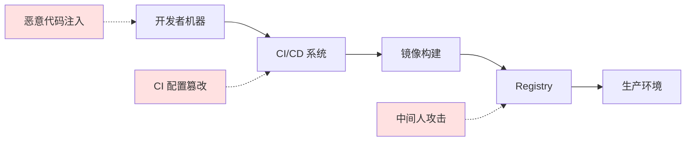
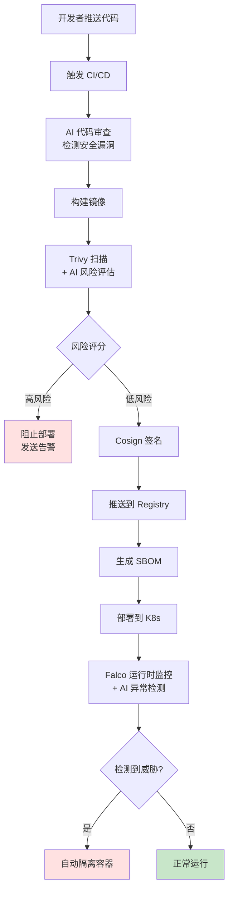

# 第六章：AI 驱动的容器安全与最佳实践 (Chapter 6: AI-Driven Security & Best Practices)

> 构建安全的容器化应用，运用 AI 工具自动检测漏洞，掌握供应链安全最佳实践

---

容器化虽然带来了便捷性,但也引入了新的安全挑战。从镜像漏洞到运行时威胁,从配置错误到供应链攻击,每一环都可能成为安全缺口。本章将探讨如何利用 AI 技术构建多层次的容器安全防御体系,并介绍业界最佳实践。

## 6.1 容器镜像漏洞扫描：AI 识别 CVE

### 6.1.1 镜像安全威胁

**常见问题**：
1. **过时的基础镜像**：如使用 `ubuntu:16.04`（已停止安全更新）
2. **易受攻击的依赖**：如 Log4Shell、Heartbleed
3. **配置错误**：以 root 运行、暴露敏感端口
4. **恶意植入**：后门、挖矿程序

**真实案例**：
```dockerfile
# ❌ 不安全的 Dockerfile
FROM ubuntu:16.04  # 过时版本
RUN apt-get update && apt-get install -y \
    libssl1.0.0  # 包含 Heartbleed 漏洞
USER root  # 以 root 运行
EXPOSE 22  # 暴露 SSH
```

### 6.1.2 传统漏洞扫描工具

#### Trivy（推荐）

```bash
# 扫描镜像
trivy image nginx:latest

# 输出示例
nginx:latest (alpine 3.14.0)
===========================
Total: 10 (CRITICAL: 2, HIGH: 5, MEDIUM: 3)

CVE-2021-44228 (Log4Shell)
CRITICAL
Package: log4j-core
Version: 2.14.0
Fixed Version: 2.17.1
```

#### Clair

```bash
# 运行 Clair 服务
docker run -d \
  -p 6060:6060 \
  -p 6061:6061 \
  quay.io/coreos/clair:latest
```

#### Anchore Engine

```bash
anchore-cli image add nginx:latest
anchore-cli image vuln nginx:latest all
```

### 6.1.3 AI 增强漏洞扫描

**传统扫描的局限**：
- 依赖已知 CVE 数据库（滞后性）
- 高误报率
- 无法检测零日漏洞

**AI 解决方案**：

#### 1. 基于 ML 的漏洞预测

```python
# 使用机器学习预测潜在漏洞
from sklearn.ensemble import RandomForestClassifier
import numpy as np

class VulnerabilityPredictor:
    def __init__(self):
        self.model = RandomForestClassifier(n_estimators=100)
        
    def extract_features(self, package):
        """提取包特征"""
        return [
            package.age_days,           # 版本年龄
            package.update_frequency,   # 更新频率
            package.dependencies_count, # 依赖数量
            package.cve_history_count,  # 历史漏洞数
            package.github_stars,       # 流行度
        ]
    
    def predict_risk(self, package):
        features = self.extract_features(package)
        risk_score = self.model.predict_proba([features])[0][1]
        return risk_score  # 0.0 - 1.0
        
# 使用示例
predictor = VulnerabilityPredictor()
for package in image.packages:
    risk = predictor.predict_risk(package)
    if risk > 0.8:
        alert(f"High risk package: {package.name}")
```

#### 2. LLM 辅助漏洞分析

```python
# 使用 GPT-4 分析复杂漏洞
import openai

def analyze_vulnerability_with_ai(cve_id, image_context):
    prompt = f"""
    分析以下容器镜像中的漏洞：
    
    CVE ID: {cve_id}
    镜像信息: {image_context}
    
    请提供：
    1. 漏洞利用难度评估
    2. 在容器环境中的实际风险
    3. 修复建议（考虑兼容性）
    4. 临时缓解措施
    """
    
    response = openai.ChatCompletion.create(
        model="gpt-4",
        messages=[{"role": "user", "content": prompt}]
    )
    
    return response.choices[0].message.content

# 示例输出
ai_analysis = analyze_vulnerability_with_ai(
    "CVE-2021-44228",
    "Alpine-based Java application"
)
print(ai_analysis)
```

**AI 输出示例**：
```
漏洞分析 - CVE-2021-44228 (Log4Shell)

1. 利用难度: ⭐⭐ (简单)
   只需发送特制的 JNDI 查询即可触发

2. 容器环境风险: 🔴 高危
   虽然容器隔离了文件系统，但攻击者可以：
   - 通过 JNDI 发起 LDAP 查询
   - 下载恶意 .class 文件执行
   - 获取容器内敏感环境变量
   
3. 修复建议:
   ✅ 升级 log4j-core 到 2.17.1+
   ⚠️  检查第三方依赖是否也包含易受攻击版本
   
4. 临时缓解:
   - 设置环境变量: LOG4J_FORMAT_MSG_NO_LOOKUPS=true
   - 移除 JndiLookup.class: zip -q -d log4j-core-*.jar org/apache/logging/log4j/core/lookup/JndiLookup.class
```

#### 3. 异常特征检测

```python
# 使用无监督学习检测异常镜像层
from sklearn.cluster import DBSCAN
import numpy as np

class AnomalyDetector:
    def __init__(self):
        self.dbscan = DBSCAN(eps=0.5, min_samples=5)
        
    def detect_malicious_layers(self, image_layers):
        features = []
        for layer in image_layers:
            features.append([
                layer.size,
                layer.file_count,
                self.entropy(layer.content),  # 高熵可能表示加密/混淆
                self.has_hidden_files(layer),
                self.has_network_tools(layer),  # 如 nc, nmap
            ])
        
        # 聚类分析
        clusters = self.dbscan.fit_predict(features)
        
        # 标记为异常值的层（cluster_id=-1）
        anomalies = [i for i, c in enumerate(clusters) if c == -1]
        return anomalies
    
    def entropy(self, data):
        """计算数据熵（检测加密/混淆）"""
        import math
        prob = [data.count(byte) / len(data) for byte in set(data)]
        return -sum(p * math.log2(p) for p in prob if p > 0)
```

### 6.1.4 自动化漏洞修复

**AI 生成修复补丁**：

```python
def generate_dockerfile_patch(vulnerability, current_dockerfile):
    prompt = f"""
    以下 Dockerfile 存在漏洞：{vulnerability.description}
    
    当前 Dockerfile:
    {current_dockerfile}
    
    请生成修复后的 Dockerfile，确保：
    1. 修复漏洞
    2. 保持功能兼容
    3. 遵循最佳实践
    
    只输出修改后的 Dockerfile，不要解释。
    """
    
    fixed_dockerfile = llm.generate(prompt)
    return fixed_dockerfile

# 生成 Pull Request
vulnerability = scan_image("myapp:latest")
fixed_df = generate_dockerfile_patch(vulnerability, read_file("Dockerfile"))
create_pr(title="Fix CVE-2021-44228", body=fixed_df)
```

---

## 6.2 运行时安全监控：基于 AI 的异常行为检测

### 6.2.1 运行时威胁类型

| 威胁类型 | 示例 | 危害 |
|---------|------|------|
| **容器逃逸** | 利用内核漏洞访问主机 | 完全控制主机 |
| **横向移动** | 从一个容器攻击其他容器 | 扩大攻击面 |
| **数据窃取** | 读取敏感文件或环境变量 | 泄露机密 |
| **资源滥用** | 挖矿程序消耗 CPU | 费用增加 |
| **恶意网络活动** | C&C 通信、DDoS 攻击 | 法律风险 |

### 6.2.2 传统运行时防护

#### Seccomp（系统调用过滤）

```json
{
  "defaultAction": "SCMP_ACT_ERRNO",
  "architectures": ["SCMP_ARCH_X86_64"],
  "syscalls": [
    {
      "names": ["read", "write", "open", "close"],
      "action": "SCMP_ACT_ALLOW"
    },
    {
      "names": ["chmod", "chown"],
      "action": "SCMP_ACT_ERRNO"
    }
  ]
}
```

#### AppArmor / SELinux

```bash
# AppArmor 配置示例
profile docker-nginx flags=(attach_disconnected,mediate_deleted) {
  #include <abstractions/base>
  
  network inet tcp,
  network inet udp,
  
  deny /proc/** w,
  deny /sys/** w,
}
```

### 6.2.3 AI 异常检测系统

#### 系统调用序列分析（LSTM）

```python
import tensorflow as tf

class SyscallAnomalyDetector:
    def __init__(self):
        # LSTM 模型学习正常系统调用模式
        self.model = tf.keras.Sequential([
            tf.keras.layers.Embedding(input_dim=400, output_dim=64),
            tf.keras.layers.LSTM(128, return_sequences=True),
            tf.keras.layers.LSTM(64),
            tf.keras.layers.Dense(1, activation='sigmoid')
        ])
        
    def train(self, normal_syscall_sequences):
        """训练阶段：学习正常行为"""
        X, y = self.prepare_data(normal_syscall_sequences)
        self.model.fit(X, y, epochs=10)
        
    def detect(self, syscall_sequence):
        """检测阶段：识别异常"""
        anomaly_score = self.model.predict([syscall_sequence])[0][0]
        
        if anomaly_score > 0.8:
            return {
                "alert": True,
                "confidence": anomaly_score,
                "reason": self.explain_anomaly(syscall_sequence)
            }
        return {"alert": False}
    
    def explain_anomaly(self, sequence):
        """解释为什么标记为异常"""
        # 使用 SHAP 或 LIME 解释模型决策
        rare_syscalls = self.find_rare_calls(sequence)
        return f"检测到罕见系统调用序列: {rare_syscalls}"

# 部署
detector = SyscallAnomalyDetector()
detector.train(load_normal_traces())

# 实时监控
while True:
    syscalls = monitor_container("app-container")
    result = detector.detect(syscalls)
    if result["alert"]:
        quarantine_container("app-container")
        alert_security_team(result)
```

#### 网络流量异常检测

```python
class NetworkAnomalyDetector:
    def __init__(self):
        self.autoencoder = self.build_autoencoder()
        
    def build_autoencoder(self):
        """使用自编码器检测异常流量模式"""
        encoder = tf.keras.Sequential([
            tf.keras.layers.Dense(64, activation='relu'),
            tf.keras.layers.Dense(32, activation='relu'),
            tf.keras.layers.Dense(16, activation='relu'),
        ])
        
        decoder = tf.keras.Sequential([
            tf.keras.layers.Dense(32, activation='relu'),
            tf.keras.layers.Dense(64, activation='relu'),
            tf.keras.layers.Dense(128, activation='sigmoid'),
        ])
        
        return tf.keras.Sequential([encoder, decoder])
    
    def train(self, normal_network_traffic):
        """学习正常流量的特征"""
        self.autoencoder.fit(normal_network_traffic, normal_network_traffic)
        
    def detect_anomaly(self, traffic):
        """重构误差高 = 异常"""
        reconstructed = self.autoencoder.predict([traffic])
        mse = np.mean((traffic - reconstructed) ** 2)
        
        if mse > self.threshold:
            return {
                "alert": True,
                "mse": float(mse),
                "suspicious_features": self.analyze_traffic(traffic)
            }
        return {"alert": False}
    
    def analyze_traffic(self, traffic):
        """分析异常流量特征"""
        features = []
        if traffic.unexpected_port:
            features.append(f"Unusual port: {traffic.port}")
        if traffic.high_frequency:
            features.append("DDoS-like pattern detected")
        if traffic.unknown_destination:
            features.append(f"C&C server communication: {traffic.dest_ip}")
        return features
```

### 6.2.4 Falco：云原生运行时安全

```yaml
# Falco 规则示例
- rule: Write below root
  desc: Detect write operations below root directory
  condition: >
    container and
    evt.type in (open,openat) and
    evt.dir=< and
    fd.name startswith /
  output: >
    File opened for writing in root directory
    (user=%user.name command=%proc.cmdline file=%fd.name)
  priority: WARNING

# AI 增强 Falco
- macro: ai_predicted_malicious
  condition: >
    ml_model.predict(proc.cmdline, proc.cwd, proc.pname) > 0.9

- rule: AI Detected Malicious Process
  desc: ML model flagged process as suspicious
  condition: >
    spawned_process and
    ai_predicted_malicious
  output: "AI Alert: Suspicious process (cmd=%proc.cmdline)"
  priority: CRITICAL
```

---

## 6.3 Dockerfile 最佳实践：AI 辅助编写与审查

### 6.3.1 常见 Dockerfile 安全问题

| 问题 | 示例 | 风险 |
|------|------|------|
| **以 root 运行** | 无 `USER` 指令 | 容器逃逸后获得主机 root |
| **暴露敏感端口** | `EXPOSE 22 3306` | 增加攻击面 |
| **泄露密钥** | `ENV API_KEY=xxx` | 代码泄露连带密钥泄露 |
| **使用 latest 标签** | `FROM nginx:latest` | 不可重现构建 |
| **安装不必要工具** | `apt-get install curl wget` | 被利用为攻击工具 |

### 6.3.2 安全 Dockerfile 模板

```dockerfile
# ✅ 安全的 Dockerfile 示例

# 使用特定版本标签（避免 latest）
FROM python:3.11-slim-bookworm

# 创建非 root 用户
RUN groupadd -r appuser && useradd -r -g appuser appuser

# 设置工作目录
WORKDIR /app

# 仅复制必要文件（遵循最小权限原则）
COPY --chown=appuser:appuser requirements.txt .

# 安装依赖（在同一层清理缓存）
RUN pip install --no-cache-dir -r requirements.txt && \
    rm -rf /root/.cache

# 复制应用代码
COPY --chown=appuser:appuser . .

# 切换到非 root 用户
USER appuser

# 健康检查
HEALTHCHECK --interval=30s --timeout=3s \
  CMD curl -f http://localhost:8000/health || exit 1

# 仅暴露必要端口
EXPOSE 8000

# 使用 exec 格式（正确处理信号）
CMD ["python", "app.py"]
```

### 6.3.3 AI 辅助 Dockerfile 审查

#### prompt 驱动的审查

```python
def ai_review_dockerfile(dockerfile_content):
    prompt = f"""
    你是一个容器安全专家。请审查以下 Dockerfile，从安全角度指出问题：
    
    {dockerfile_content}
    
    检查项：
    1. 是否使用 root 用户运行
    2. 是否包含敏感信息（密钥、密码）
    3. 基础镜像是否过时
    4. 是否安装了不必要的工具
    5. 层数是否可以优化
    6. 是否遵循最佳实践
    
    对每个问题，提供：
    - 严重程度（Critical/High/Medium/Low）
    - 具体位置（行号）
    - 修复建议
    
    输出格式：JSON
    """
    
    response = llm.generate(prompt)
    issues = json.loads(response)
    
    return issues

# 示例输出
review_result = ai_review_dockerfile(read_file("Dockerfile"))
```

**AI 输出**：
```json
[
  {
    "severity": "Critical",
    "line": 12,
    "issue": "Running as root user",
    "description": "Container will run as root (UID 0), increasing risk if container is compromised",
    "fix": "Add:\nRUN useradd -m -u 1000 appuser\nUSER appuser"
  },
  {
    "severity": "High",
    "line": 5,
    "issue": "Hardcoded secret",
    "description": "API key exposed in environment variable",
    "fix": "Use Docker secrets or external secret management:\ndocker run --env-file .env myapp"
  },
  {
    "severity": "Medium",
    "line": 8,
    "issue": "Inefficient layering",
    "description": "Multiple RUN commands can be merged",
    "fix": "Combine:\nRUN apt-get update && \\\n    apt-get install -y curl && \\\n    rm -rf /var/lib/apt/lists/*"
  }
]
```

#### 自动生成安全 Dockerfile

```python
def generate_secure_dockerfile(app_type, requirements):
    prompt = f"""
    为 {app_type} 应用生成一个生产级的安全 Dockerfile。
    
    需求：
    - 编程语言：{requirements.language}
    - 依赖：{requirements.dependencies}
    - 端口：{requirements.port}
    
    要求：
    1. 多阶段构建（分离构建和运行环境）
    2. 使用非 root 用户
    3. 最小化镜像体积
    4. 包含健康检查
    5. 使用特定版本标签
    
    只输出 Dockerfile，不要解释。
    """
    
    return llm.generate(prompt)

# 使用
dockerfile = generate_secure_dockerfile(
    app_type="web_api",
    requirements={
        "language": "Python 3.11",
        "dependencies": ["flask", "psycopg2"],
        "port": 5000
    }
)

print(dockerfile)
```

---

## 6.4 供应链安全：签名与验证 (Notary / Cosign)

### 6.4.1 供应链攻击威胁

**真实案例**：
- **SolarWinds (2020)**：恶意代码植入构建流程
- **Codecov (2021)**：Bash Uploader 脚本被篡改
- **Docker Hub (2019)**：17 个镜像被植入挖矿程序

**攻击向量**：


### 6.4.2 Docker Content Trust (DCT)

```bash
# 启用 DCT
export DOCKER_CONTENT_TRUST=1

# 推送镜像（自动签名）
docker push myregistry.com/app:v1.0
# 生成密钥对，提示输入密码

# 拉取镜像（验证签名）
docker pull myregistry.com/app:v1.0
# 如果签名无效，拉取失败
```

**密钥管理**：
```bash
~/.docker/trust/
├── private/
│   ├── root_keys/
│   └── tuf_keys/
└── tuf/
    └── myregistry.com/
        └── app/
            └── metadata/
```

### 6.4.3 Sigstore Cosign（现代签名方案）

```bash
# 安装 Cosign
brew install cosign

# 生成密钥对
cosign generate-key-pair

# 签名镜像
cosign sign --key cosign.key myregistry.com/app:v1.0

# 验证签名
cosign verify --key cosign.pub myregistry.com/app:v1.0

# 使用 keyless 签名（OIDC）
cosign sign myregistry.com/app:v1.0
# 浏览器打开 OAuth 流程（GitHub/Google 登录）
```

### 6.4.4 SBOM（软件物料清单）

```bash
# 使用 Syft 生成 SBOM
syft packages nginx:latest -o json > sbom.json

# 使用 Grype 根据 SBOM 扫描漏洞
grype sbom:./sbom.json

# 将 SBOM 附加到镜像（Cosign）
cosign attach sbom --sbom sbom.json myregistry.com/app:v1.0
```

**SBOM 示例**（SPDX 格式）：
```json
{
  "spdxVersion": "SPDX-2.3",
  "name": "myapp",
  "packages": [
    {
      "name": "openssl",
      "versionInfo": "1.1.1k",
      "supplier": "Organization: OpenSSL",
      "filesAnalyzed": false,
      "externalRefs": [
        {
          "referenceType": "purl",
          "referenceLocator": "pkg:deb/ubuntu/openssl@1.1.1k"
        }
      ]
    }
  ]
}
```

### 6.4.5 AI 驱动的供应链分析

```python
class SupplyChainAnalyzer:
    def __init__(self):
        self.risk_model = self.load_risk_model()
        
    def analyze_dependency_tree(self, sbom):
        """分析依赖树的安全风险"""
        risks = []
        
        for package in sbom.packages:
            risk_score = self.assess_package_risk(package)
            
            if risk_score > 0.7:
                risks.append({
                    "package": package.name,
                    "score": risk_score,
                    "reasons": self.explain_risk(package)
                })
        
        return risks
    
    def assess_package_risk(self, package):
        features = [
            self.package_age(package),
            self.maintainer_reputation(package),
            self.cve_history_count(package),
            self.is_abandoned(package),  # 最后更新时间 > 2年
            self.has_few_users(package),
        ]
        
        return self.risk_model.predict([features])[0]
    
    def explain_risk(self, package):
        """AI 解释风险原因"""
        prompt = f"""
        分析 {package.name} (v{package.version}) 的供应链风险：
        
        - 维护者：{package.maintainer}
        - 最后更新：{package.last_update}
        - 历史 CVE 数：{package.cve_count}
        - 下载量：{package.downloads}
        
        可能的风险因素是什么？应该采取什么措施？
        """
        
        return llm.generate(prompt)

# 使用
analyzer = SupplyChainAnalyzer()
sbom = load_sbom("myapp")
risks = analyzer.analyze_dependency_tree(sbom)

for risk in risks:
    print(f"⚠️  {risk['package']} (Score: {risk['score']:.2f})")
    print(risk['reasons'])
```

---

## 6.5 综合案例：构建 AI 安全流水线



**GitHub Actions 实现**：
```yaml
name: AI-Powered Security Pipeline

on: [push]

jobs:
  security-scan:
    runs-on: ubuntu-latest
    steps:
      - uses: actions/checkout@v3
      
      # 1. AI 代码审查
      - name: AI Code Review
        run: |
          python scripts/ai_security_review.py \
            --files $(git diff --name-only HEAD^)
      
      # 2. 构建镜像
      - name: Build Image
        run: docker build -t myapp:${{ github.sha }} .
      
      # 3. Trivy 扫描
      - name: Run Trivy
        uses: aquasecurity/trivy-action@master
        with:
          image-ref: 'myapp:${{ github.sha }}'
          format: 'json'
          output: 'trivy-results.json'
      
      # 4. AI 风险评估
      - name: AI Risk Assessment
        run: |
          python scripts/ai_risk_analyzer.py \
            --trivy-results trivy-results.json \
            --threshold 0.7
      
      # 5. 签名镜像
      - name: Sign with Cosign
        if: success()
        run: |
          cosign sign --key ${{ secrets.COSIGN_KEY }} \
            myapp:${{ github.sha }}
      
      # 6. 生成 SBOM
      - name: Generate SBOM
        run: syft packages myapp:${{ github.sha }} -o json > sbom.json
      
      # 7. 推送
      - name: Push Image
        if: success()
        run: docker push myapp:${{ github.sha }}
```

---

## 总结

容器安全是一个多层次的防御体系：

1. **镜像安全**：AI 增强的漏洞扫描 + 自动修复
2. **运行时安全**：ML 异常检测 + Seccomp/AppArmor
3. **配置安全**：AI 辅助 Dockerfile 审查
4. **供应链安全**：签名验证 + SBOM + 依赖风险分析

**关键原则**：
- ✅ **最小权限**：非 root 用户、最小化工具安装
- ✅ **深度防御**：多层安全控制
- ✅ **持续监控**：运行时异常检测
- ✅ **自动化**：AI 驱动的安全流水线

**下一章预告**：我们将通过三个完整的实战项目，将前面学到的知识付诸实践。

**[>> 进入第七章](./07-hands-on-projects.md)**

---

**贡献者欢迎**: 如果您对本章节有内容补充或建议，欢迎提交 PR 或 Issue！
